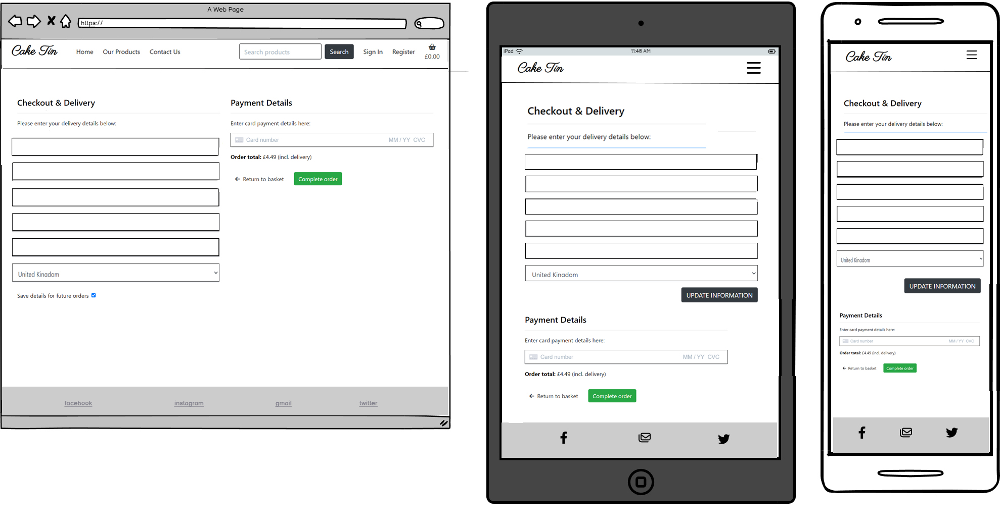

# [CAKE TIN](https://cake-tin-c51245f8ed0d.herokuapp.com/)

The aim of Cake Tin is to sell cupcakes online so that customers can easily purchase what they want online aswell as instore. 
The site owners aim is to scale up the business and sell to customers locally but also further a field to produce more sales and customers for the business. 
The target audience is a broad range but the regular customers are aged between 18 - 40 and this age range are very digital literate so having the online option should increase sales and make it more convenient for customers who may not have the time or 
be able to travel to the store to purchase.

The second aim of the website is to use the website as a way to advertise the USP of the cupcakes which are that all ingredients are from local suppliers to support the community businesses such as the milk and eggs from the local farmers etc. 

https://ui.dev/amiresponsive?url=https://cake-tin-c51245f8ed0d.herokuapp.com


Below you can see the charts and user stories I created to visualise the flow of the website and any error messages or actions needed depending on the user interaction. You can see on the charts I have worked out what data needs to be collected or added to the database depending on user interaction and what error messages need to be put in place incase of an unexpected/incorrect response.

<details>
<summary> Click here to see data flow charts and user stories</summary>

Flow Charts
  - 

User Stories
  - 

</details>


## UX

The Cake Tin is a simple interactive website that is user-friendly and easy to use as it has a wide age range of target audience. The website has been repsponsivley designed meaning it is user-friendly for online, tablet and mobile users. This standard structure design means it can also be easily developed further in the future and has the potential to add many more features to it without the site looking overcrowded. It's a smooth journey from the begining of the customers journey to the end, making it as easy as 3 simple click the product they would like to the basket. The products are sectioned into categories so users find it easily to refind their search depending what they are looking for and also for the site owner to easily section their new products and special offers that they have. Ohter features such as links, buttons, simple forms and hover effects have all been included into the design to help the smooth user experience through the website. 

### Colour Scheme

Minimal helps create a product-focus web look since it keeps elements to the minimum with many white spaces, which makes sure the user's focus is on the products. Therefore, the main colours throughtout the site are black and white leaving the colourful and eye catching photography to add colour to the website to focus on the purpose of the website which is to sell the cakes. The black colour is also used to inform or guide the users to the primary information or buttons they are looking for such as search inputs, brand logo, headings but also to the information we want the user to be drawn to. For the images I have used similar photography shots for each cake so they can be seen as a collection, for example the 'Winter Collection' all have the same photography style so its easy for the user to differentiate between the collection range and the normal range, particularly when user select 'All products' but also to look effective when seen in together as a collective.   

- `#000000` used for primary text.

I used [coolors.co](https://coolors.co/d3d3d3-343a40-000000-ffffff) to generate my colour palette.


### Typography

- [Parisienne](https://fonts.google.com/specimen/Parisienne) was used for the logo.

- [Font Awesome](https://fontawesome.com) icons were used throughout the site, such as the social media icons in the footer.

## User Stories

### New Site Users

- As a new site user, I would like to register for an account, so that I can have my own account.
- As a new site user, I would like to create a secure password, so that I can be assured my account is secure.
- As a new site user, I would like to view the selection of cakes, so that I can see what the product looks like.
- As a new site user, I would like to see a product description page, so that I can see the price, product description, image and nutrition & allergy details.
- As a new site user, I would like to easily see offer or sale products, so that I can get a good deal which may persuade me to be a returning customer.
- As a new site user, I would like to easily search for a particular cake, so that I do not have to scroll through each product to get to what I am looking for. 
- As a new site user, I would like to easily be able to select a quantity of cakes, so that I know how much exactly I am purchasing. 
- As a new site user, I would like to easily be able to view items in my bag that I can check what I am purchasing again before payment.
- As a new site user, I would like to receive and view and order confirmation message so that I can verify my order is complete.
- As a new or existing site user I would like to be able to enter payment details so I can simply purchase the good I would like.

### Returning Site Users

- As a returning site user, I would like to simply log in and log out, so that I can easily access my profile page.
- As a returning site user, I would like to have my own profile, so that I can save payment information and view order history.
- As a returning site user, I would like to recover my password if I have forgotten it, so that I can gain access back to my account.
- As a returning site user, have visual sight of my shopping basket , so that I can keep track of the total amount I am spending to make sure it is affordable for me.
- As a returning site user, I would like to see a list of categories of cake types, so that I can easily navigate to the product I want such a new collection or offers and sales.
- As a returning site user, I would like to view recent purchases, so that I don't have to go searching for a product I purchased previously or have to retype the product each time.

### Site Admin

- As a site administrator, I should be able to add new products, so that I can add new items to my store.
- As a site administrator, I should be able to edit products, so that I can edit any items that need amending such a price etc.
- As a site administrator, I should be able to delete products, so that I can remove any products no longer on sale.
- As a site administrator, I should be able to section products into categories, so that I can organise the products easily.
- As a site administrator, I should be able to easily put items on sale, so that I can put special offers on if I want to.

## Wireframes

To follow best practice, wireframes were developed for mobile, tablet, and desktop sizes.
I've used [Balsamiq](https://balsamiq.com/wireframes) to design my site wireframes.

<details>
<summary> Click here to see the Wireframes </summary>

Home
  - 

Our Products (All Cupcakes, cake tin classics, winter collection, valentines collection & special offers )
  - 

Contact
  - 

Basket
  - 

Checkout & Payment details
  - 

Product Description
  - 

Product Management
  - 

Sign in
  - 

Register
  - 

Log out
  - 

Profile
  - 

Confirmation page
  - 

Newsletter
  - 

</details >

## Features

### Existing Features

- **Navbar #1**

    - The navbar is the way to navigate around the site and is also responsive for smaller devices too. The navbar includes many of the important features for the e-commerce site, such as branding, links for each page, search input, basket total, login/logout button, and register button. The navbar is also a sticky navbar, meaning it will always be available at the top of the page to be user-friendly, as users do not have to be inconvenienced by scrolling back up to the top of the page to change pages. The search input allows users to search for products of a specific type, such as 'Mint', and it will display any cupcakes with the word mint in their product description or name, making the search easier for customers who know what flavour or type of cake they would specifically like.
    I designed the navbar to keep the background white so it blends in nicely with the page and adds to the classy look and flow of the site.

    

- **Logo #2**

    - The logo is a vital part of the site, as it is how customers recognise the brand and the business, giving the target audience an idea of what the company is. The target audience will recognise the brand and business by its logo and may even make a judgement based on how the logo looks.
    For the logo style, I have simply used the Parisienne font, which has a handwritten cursive style that helps portray the classy and elegant look we want the branding to display.

    

- **Carousel #3**

    - I have used Bootstrap to help create a carousel for the product images on the home page, as it's a great way of displaying all products, and it will display a random image each time a user visits. The carousel scrolls automatically, or they can use the indicators to scroll through at their own pace, one at a time rather than all at once. referring to Hick's law, it reduces the complex structure of information. The value the carousel brings to the site is that it enables more than one image to occupy the same piece of the website without looking overcrowded.
    The style of my website is to use the images to add colour to the website and keep everything else black and white so the user focuses on the images, so having the carousel adds a nice simplistic effect to the site to display different items.

    

- **Callout heading and button #4**

    - The callout heading and button are a simple way to advertise the latest collection or anything the site owner would like the customers to notice as they first enter the site. It is followed by a'shop now' button underneath so the user can easily be directed to the page of the products they are referring to in the callout heading, helping push sales and interest.

    

- **Category dropdown #5**

    - I have used a drop-down menu to display all the different categories available in one place under the 'our products' navbar button. Dropdowns are useful because they allow users to quickly and easily select an option without having to type anything or navigate to another page. They also allow them to see all the options in one place.
    It also saves space on a webpage by only displaying options when needed, so it does not look complex for users who are not so tech-savvy. 

    

- **Footer #6**

    - The footer is simply based at the bottom of the page with a grey background that have the options of different social media links used from font awesome which are highlighted in red when hovered over and also the copyright information also displayed in black. The footers' benefits are that it gives the option to view Cake Tin's online presence easily, as they can see real-time feedback from other customers. It is convenient as the links go directly to the social media websites, so the users do not have to go looking for the social media websites independently, it is all in one place. With this in mind, it can increase followers on their social media too allowing more interest and potential buyers for the business owner.

    

- **Product cards #7**

    - I have used bootstrap cards to display each cupcake on the products pages so they are neatly displayed very clearly and obvious to the users. Again, I have kept the background of these cards white and added a box shadow instead of a border line so the users can clearly see they are cards and I can keep the styling minimal. The reason I did not want to add a line border is because I am trying to keep the attention on the images and use little colour as the images will add the colours to the site which highlights they are the focus of the site.
    The cards also include important information such as the name and price of the products which are displayed using black font so users can see the prices clearly.

    


- **Product description, price and quantity selection #8**

    - A product detail page is essential to the marketing strategy as the page leads directly to a sale and provides more information about the product customers are interested in. Without a product detail page it will make customers more skeptical about purchasing the cakes and may deter them from adding anything to the basket.
    Also, accurate and detailed product descriptions minimize the risk of customer complaints and returns.
    Giving customers all the information they need to make a purchase is the end goal such as product name & description, price, quantity, promotional information, nutritional and allergen information and a checkout button.
    The quantity selection is also there to conveniently give the users the option to put in a different quantity if they want more than one rather than having to each one individually making it more user friendly.

    


- **Add to bag & Continue shopping buttons #9**

    - As mentioned above in the product description features the page also includes a checkout button allowing customers to easily navigate to the basket page to check over their orders. The button is clearly higlighted in green to make it eye-catching to the users to simplify the use of the website and indicate what needs to be pressed to checkout the products if they are ready to do so. To the left of the checkout button includes a 'continue shopping' button for the ease of the customer if they want to go back and look at other products. Again, to make it clear to the customers I have used an icon from font awesome which helps customers understand it is a button to go back which is one of the common conventions used when using a website and so is a symbol many people understand. 

    


- **Nutrition and Allergen information #10**

    - Again, as mentioned in the product description feature the product page also includes a nutritional and allergen feature which displays all the ingredients, calories and important allergen information which a customer may look for before deciding to purchase a product. I have displayed this information in a bootstrap accordion so that the users can display the information when needed, and the accordion has been placed directly below the product image so the information cannot be missed and is easy to locate.
    I have also used a background colour of grey so that it stands out below the colourful image. 

    

- **Newsletter button #11**

    - I have added a simple subscribe now button on the bottom of the home page carousel to direct the users to the newsletter form. I have made the background of the button the same colour used on the other buttons on the website to make it clear that it is a button followed by white uppercase text to intice to the users to look there too. It also displays an underline when hovered so the user clearly knows it is a button. 

    

- **Newsletter Form #12**

    - When clicked on the newsletter button as mentioned in the above feature it will direct you to a subscription newsletter form which is a simplisitc input box allowing users to simply do two actions of adding their email in the box and clicking subscribe making it a painless process for customers to opt in for newsletters. The simple sign up approach means for newsletter sign up for the site owner and more interested customers to advertise to.
    Using the same colours as the newsletter button on the homepage the subsrcibe form button has a dark grey background and white text so the user knows exactly what to click to submit the form.
    The form also includes the '*required* underneath the subscribe now heading so the user understands they have to include an email before clicking subscribe which keeps the users information to make sure they do not get frustrated.

    

- **Add to basket toaster #13**

    - When the add to basket button is clicked on the product description page the users will be helpfully notified that it was successfully added by the toaster pop up which also includes the quantity and name of the product they added aswell as the preview image and order total so they are always aware of their basket total. 
    It will also include a highlighted green button to help customer to go to checkout if they want to checkout immediatley or an 'x' on the top right corner to disable to notifcation. 

    

- **Basket #14**

    - Customer can sometimes user the basket like a wishlist and add lots of things before going through the list to remove those they don’t want so the basket is a useful tool for customers to summarise the review their order before checkout and payment. They might want to check their options on each item such as price, quantity, product type,and subtotal of each item added and so each details has been organised into a table feature so they can easily understand the data. For example, there is a table header featuring each item detail and then the price, quanitity, images etc are place in the applicable column so the information is displayed and sectioned clearly. 

    There is an input box on the basket page so if there is something the user may have missed or forgotten about on the product page the can remove or add using the quantity input box. There is then a simple 'Update' button labelled in blue to click to update the quantity and a red 'remove' button to easily completely remove the item. To make the basket user-friendly I have also added the option of reducing the order to zero in order to delete the item from their basket.
    To make the page obvious it is the basket page I have clearly labelled the page with 'Your basket' header so the user knows exactly what part of the purchase process they are on and again included a highlighted green button as used on every other checkout button through the site so the customers knows the green buttons relate to the basket/checkout. 

    

- **Order Summary #15**

    - Also on the basket page is an order Summary which has its own column. The reason I chose this layout is naturally the user reads things from left to right so I wanted to place order summary to the right so the customer can easily see the breakdown of the order total. The order total displays the sub-total, delivery and the order amount in total. The order summary is a header so the user knows that section is the summary and the order total is also in bold to highlight the final amount before purchase. Again, the black font has been used for the order summary feature and making the important words bold. 

    

- **Checkout Form #16**

    - The checkout form has a header clearly labelling the checkout and delivery information form with a subheader explaining what information needs to be filled in the form so the customer does not have to be confused on what information to put in. The form includes 7 inputs for the address information and a dropdown for the countries to make sure all users conform to the correct country format.
    The last feature of the form is a checkbox allowing the user decide if they want to save their information for future purchases if they are signed in so that next time they make a purchase the information will be already pre-filled into the text inputs making it much more convenient and time efficient for the user.

    

- **Payment Details #17**

    - The payment form also had a header of payment details in a heading so the user can see what information needs to be input in this section of the page. Just like the basket page I broken the page into 2 halves and have the checkout form on one half followed by the payment section on the other half so the user can easily identify what information goes where. The order total is displayed again in black bold font so the customer knows how much the order total is just before payment including delivery.
    Again included a highlighted green button as used on every other checkout button through the site so the customers knows the green buttons relate to the basket/checkout but this time it has the text 'Complete Order' to finalise the purchase.  

    

- **Order Confirmation #19**

    - The order confirmation page is a simple page which displays once the user has made a purchase and includes all the information summarised in the order so the user can check it all again and keep as a receipt. All of the font is displayed in black with the headings in a bold font. 

    

- **Toast alerts #20**

    - When the user or admin is using the sites there are many toaster alerts keeping them updated with any changed, removed or informative information to make sure the user or admin assured that their actions have been successful or unsuccesful.

    

- **Profile #21**

    - The Profile form has a header clearly labelling 'My profile' with a subheader explaining the information in the form is their 'Default information'. The form includes 6 inputs for the address information and a dropdown for the countries to make sure all users conform to the correct country format.
    They are then presented with a dark grey box with white text that says 'Update information' so that the users can update their address if it changes anytime to make sure if they save their information on payment their correct address will pre-fill in the boxes upon checkout. 

    

- **Order History #22**

    - Also on the profile page, there is an order history section on the right side of the page as I have again chosen to split the layout into 2 so the users can clearly see the information without scrolling on larger screen sizes. I have again used a table with a table header that includes bold black text with the headings Order Number, date, items, and order total so if customers want to refer back to their previous orders they have all the information on the purchase. The information is then sectioned into row so the users can read the information easily.
    Each order number is a blue colour to show they are a link and when clicked on it displays the order confirmation of that particular order no matter what date it is. This is beneficial for the business owner also as it means if customer wanted to purchase the same cake/order as last time but cannot remebered the name of the product they can simply look back on their order confirmation.

    

- **Edit/delete buttons for admin #23**

    - The edit and delete button is only displayed for the admin of the site and when the edit button is clicked it is automatically filled with the details of the selected product the admin wants to edit, so they can edit what they need accordingly and then select 'Update Product' to update the details. The edit button is again in a blue text so the admin relates to it as a link and the delete buttons are in a danger red colour as they should be careful clicking that unless they are certain. Once the item is clicked on delete the item is deleted from the site and admin instantly so the user can immediatley update their site with any changes. The edit and delete button are displayed both on the product images and product description for ease of use for the admin users.

    

- **Add/Edit Product #24**

    - Add event is the same style form as the edit form on the site so that the admin becomes familiar with the structure and layout of the forms and again, the form is also responsive so it can be used well on all different sized devices. The inputs include product category, name, description, price, image, nutritional & allergen information amd sale information followed by the add/edit button on the bottom of the form to simply add or edit the event. In case of the admin changing their mind, I have also included a cancel button should they need to return to the page if they decide not to add or edit a product to make sure that they don't need to use the back button on the browsers site.

    

- **Contact infograph #25**

    - On the contact form there are 3 large black outlined logos that users should be familiar with so they can easily locate what type of contact method they are needed. They are black and outlined to blend with the style and theme of the site of being minimal and they can easily find the contact, email and location details of the business.

    

- **Contact Form #26**

    - The page also provides an email form so the customer can emails us directly from that page of the site rather than having to go to an external website to email us. The form contains 4 inputs, name, email, contact number and message so its simple to understand again followed by a dark grey send button to make it clear how to send the form to customers. 

    

- **Sale feature #27**

    - On the product cards I have also included a sale feature so that if the cupcakes are on offer it will display the original price in red and a strike through it with the new price next to it in bold so the users are clear on how much it has been discounted to and what the new price is. 
    To also make it more eyecatching for the users I have included a sale badge of the top right corner of the card images so the sale products are clearly labelled when the user is not specifically on the special offers page.

    

- **Search Results #28**

    - On each page of the our products page includes the name of the category in the top right corner of the pages followed by the number of returned results for that category or search. It is also the same if customers search with the search input box in the navbar, it will return the number of related search results for that product name. The category name is in a black poppins font and the results are in a bold black font so it is noticeable to the users.

    

- **Category page heading #29**

    - I have added custom page headers for each page so the users know instantly what products are displayed on that page and where to look for the short description which explains each page. For example, the all cupcakes product page has the title All Cupcakes, the winter collection has the title 'Winter Collection' and the same for each other page.

    

- **Sign in, Register and log out #30**

    - The log in and register features are important features as without them the signed up users would not be able to log in and new users would not be able to register. The log in form has 2 inputs for a username and password whereas the register form additionally includes a confirm email and password input and both have a large log in/sign up button to log in or register the user once entered their details. For convenience of the user for a better experience I have added a session cookie so whenever a user logs in the information stored and remembered on the browser until the user logs out.

    The login form includes a forgot password link which will bring more ease to the customer journey when using the site and will make sure they are provided with as much support as possible to make it a quick but smooth experience if they forget their password for example. Providing a smooth experience is integral to avoid the user feeling confused or frustrated and leaving the site.

    The log out option follows the same theme of the header stating the 'Log out' page and then a statement checking that they definately want to log out incase the user has clicked the button by mistake. The user then has the options to cancel or continue to log out again following the colour theme of black and white.

    

- **Error 404 and 500 pages #31**
    - On live site I have made sure that the error 404 and 500 display if the users lands on any of these errors making the page a bit more user-friendly and applying a 'return home' dark grey background button with white text to make sure they have an easy link back to the homepage should either of these errors appear. The value this could bring is to keep the customers on the site page and avoid them becoming frustrated and leaving the page as they don't have a simple button back to the site.

    


### Future Features

- Postcode checker #1
    - quick search input where you can type in your postcode to see if we deliver in your area or if there is a store near the customer.
- Add more category section or filters #2
    - Include vegan, gluten free sections etc.
- Testimonials #3
    - link google reviews or trust pilot review to website.
- Link social media to the website #4
	- Allow users to see recent social media posts on the website
- verfication email set up
	- set a functionality up where users have to verify their email when signing up.

## Tools & Technologies Used

- [HTML](https://en.wikipedia.org/wiki/HTML) used for the main site content.
- [CSS](https://en.wikipedia.org/wiki/CSS) used for the main site design and layout.
- [JavaScript](https://www.javascript.com) used for user interaction on the site.
- [Python](https://www.python.org) used as the back-end programming language.
- [Git](https://git-scm.com) used for version control. (`git add`, `git commit`, `git push`)
- [GitHub](https://github.com) used for secure online code storage.
- [Gitpod](https://gitpod.io) used as a cloud-based IDE for development.
- [Bootstrap](https://getbootstrap.com) used as the front-end CSS framework for modern responsiveness and pre-built components.
- [Django](https://www.djangoproject.com) used as the Python framework for the site.
- [ElephantSQL](https://www.elephantsql.com) used as the Postgres database.
- [Heroku](https://www.heroku.com) used for hosting the deployed back-end site.
- [Stripe](https://stripe.com) used for online secure payments of ecommerce products/services.
- [AWS S3](https://aws.amazon.com/s3) used for online static file storage.
- [TinyPNG](https://tinypng.com) used tool for image compression.
- [graphviz](https://graphviz.org/) used to generate the ERD database design graph for my models.

## Database Design

Entity Relationship Diagrams (ERD) help to visualize database architecture before creating models.
Understanding the relationships between different tables can save time later in the project.

`Products App`

```python
class Category(models.Model):

    class Meta:
        verbose_name_plural = 'Categories'
        
    name = models.CharField(max_length=254)
    display_name = models.CharField(max_length=254, null=True, blank=True)

    def __str__(self):
        return self.name

    def show_display_name(self):
        return self.display_name

    
class Product(models.Model):
    category = models.ManyToManyField('Category')
    name = models.CharField(max_length=254)
    description = models.TextField()
    price = models.DecimalField(max_digits=6, decimal_places=2)
    image = models.ImageField(null=True, blank=True)
    nutritional = models.TextField(null=True)
    allergen = models.TextField(null=True)
    # sale item
    is_on_sale = models.BooleanField(default=False)
    sale_price = models.DecimalField(default=0, decimal_places=2, max_digits=6)

    def image_preview(self):
        from django.utils.html import format_html
        if self.image:
            return format_html(f"")
        else:
            return format_html(
                f"")

    def __str__(self):
        return self.name
```

### Custom Models

I have created 2 custom models:

`Contact App`

```python
class Contact(models.Model):
    name = models.CharField(max_length=254, null=False, blank=False)
    email = models.EmailField(max_length=254, null=False, blank=False)
    contact_number = models.CharField(max_length=25, null=True, blank=True)
    message = models.TextField(null=False, blank=False)

    def __str__(self):
        return self.name
```

`Newsletter App`

```python
class NewsletterUser(models.Model):
    email = models.EmailField()
    date_added = models.DateTimeField(auto_now_add=True)

    def __str__(self):
        return self.email
```

I have used `graphviz` and `django-extensions` to auto-generate an ERD.


source: [medium.com](https://medium.com/@yathomasi1/1-using-django-extensions-to-visualize-the-database-diagram-in-django-application-c5fa7e710e16)


## Testing

For all testing, please refer to the [TESTING.md](TESTING.md) file.

## Deployment

The live deployed application can be found deployed on [Heroku](https://cake-tin-c51245f8ed0d.herokuapp.com/).

### ElephantSQL Database

This project uses [ElephantSQL](https://www.elephantsql.com) for the PostgreSQL Database.

To obtain your own Postgres Database, sign-up with your GitHub account, then follow these steps:

- Click **Create New Instance** to start a new database.
- Provide a name (this is commonly the name of the project: cake-tin).
- Select the **Tiny Turtle (Free)** plan.
- You can leave the **Tags** blank.
- Select the **Region** and **Data Center** closest to you.
- Once created, click on the new database name, where you can view the database URL and Password.

### Amazon AWS

This project uses [AWS](https://aws.amazon.com) to store media and static files online, due to the fact that Heroku doesn't persist this type of data.

Once you've created an AWS account and logged-in, follow these series of steps to get your project connected.
Make sure you're on the **AWS Management Console** page.

#### S3 Bucket

- Search for **S3**.
- Create a new bucket, give it a name (matching your Heroku app name), and choose the region closest to you.
- Uncheck **Block all public access**, and acknowledge that the bucket will be public (required for it to work on Heroku).
- From **Object Ownership**, make sure to have **ACLs enabled**, and **Bucket owner preferred** selected.
- From the **Properties** tab, turn on static website hosting, and type `index.html` and `error.html` in their respective fields, then click **Save**.
- From the **Permissions** tab, paste in the following CORS configuration:

	```shell
	[
		{
			"AllowedHeaders": [
				"Authorization"
			],
			"AllowedMethods": [
				"GET"
			],
			"AllowedOrigins": [
				"*"
			],
			"ExposeHeaders": []
		}
	]
	```

- Copy your **ARN** string.
- From the **Bucket Policy** tab, select the **Policy Generator** link, and use the following steps:
	- Policy Type: **S3 Bucket Policy**
	- Effect: **Allow**
	- Principal: `*`
	- Actions: **GetObject**
	- Amazon Resource Name (ARN): **paste-your-ARN-here**
	- Click **Add Statement**
	- Click **Generate Policy**
	- Copy the entire Policy, and paste it into the **Bucket Policy Editor**

		```shell
		{
			"Id": "Policy1234567890",
			"Version": "2012-10-17",
			"Statement": [
				{
					"Sid": "Stmt1234567890",
					"Action": [
						"s3:GetObject"
					],
					"Effect": "Allow",
					"Resource": "arn:aws:s3:::your-bucket-name/*"
					"Principal": "*",
				}
			]
		}
		```

	- Before you click "Save", add `/*` to the end of the Resource key in the Bucket Policy Editor (like above).
	- Click **Save**.
- From the **Access Control List (ACL)** section, click "Edit" and enable **List** for **Everyone (public access)**, and accept the warning box.
	- If the edit button is disabled, you need to change the **Object Ownership** section above to **ACLs enabled** (mentioned above).

#### IAM

Back on the AWS Services Menu, search for and open **IAM** (Identity and Access Management).
Once on the IAM page, follow these steps:

- From **User Groups**, click **Create New Group**.
	- Suggested Name: `group-cake-tin` (group + the project name)
- Tags are optional, but you must click it to get to the **review policy** page.
- From **User Groups**, select your newly created group, and go to the **Permissions** tab.
- Open the **Add Permissions** dropdown, and click **Attach Policies**.
- Select the policy, then click **Add Permissions** at the bottom when finished.
- From the **JSON** tab, select the **Import Managed Policy** link.
	- Search for **S3**, select the `AmazonS3FullAccess` policy, and then **Import**.
	- You'll need your ARN from the S3 Bucket copied again, which is pasted into "Resources" key on the Policy.

		```shell
		{
			"Version": "2012-10-17",
			"Statement": [
				{
					"Effect": "Allow",
					"Action": "s3:*",
					"Resource": [
						"arn:aws:s3:::your-bucket-name",
						"arn:aws:s3:::your-bucket-name/*"
					]
				}
			]
		}
		```
	
	- Click **Review Policy**.
	- Suggested Name: `policy-cake-tin` (policy + the project name)
	- Provide a description:
		- "Access to S3 Bucket for cake-tin static files."
	- Click **Create Policy**.
- From **User Groups**, click your "group-cake-tin".
- Click **Attach Policy**.
- Search for the policy you've just created ("policy-cake-tin") and select it, then **Attach Policy**.
- From **User Groups**, click **Add User**.
	- Suggested Name: `user-cake-tin` (user + the project name)
- For "Select AWS Access Type", select **Programmatic Access**.
- Select the group to add your new user to: `group-cake-tin`
- Tags are optional, but you must click it to get to the **review user** page.
- Click **Create User** once done.
- You should see a button to **Download .csv**, so click it to save a copy on your system.
	- **IMPORTANT**: once you pass this page, you cannot come back to download it again, so do it immediately!
	- This contains the user's **Access key ID** and **Secret access key**.
	- `AWS_ACCESS_KEY_ID` = **Access key ID**
	- `AWS_SECRET_ACCESS_KEY` = **Secret access key**

#### Final AWS Setup

- If Heroku Config Vars has `DISABLE_COLLECTSTATIC` still, this can be removed now, so that AWS will handle the static files.
- Back within **S3**, create a new folder called: `media`.
- Select any existing media images for your project to prepare them for being uploaded into the new folder.
- Under **Manage Public Permissions**, select **Grant public read access to this object(s)**.
- No further settings are required, so click **Upload**.

### Stripe API

This project uses [Stripe](https://stripe.com) to handle the ecommerce payments.

Once you've created a Stripe account and logged-in, follow these series of steps to get your project connected.

- From your Stripe dashboard, click to expand the "Get your test API keys".
- You'll have two keys here:
	- `STRIPE_PUBLIC_KEY` = Publishable Key (starts with **pk**)
	- `STRIPE_SECRET_KEY` = Secret Key (starts with **sk**)

As a backup, in case users prematurely close the purchase-order page during payment, we can include Stripe Webhooks.

- From your Stripe dashboard, click **Developers**, and select **Webhooks**.
- From there, click **Add Endpoint**.
	- `https://cake-tin-c51245f8ed0d.herokuapp.com/checkout/wh/`
- Click **receive all events**.
- Click **Add Endpoint** to complete the process.
- You'll have a new key here:
	- `STRIPE_WH_SECRET` = Signing Secret (Wehbook) Key (starts with **wh**)

### Gmail API

This project uses [Gmail](https://mail.google.com) to handle sending emails to users for account verification and purchase order confirmations.

Once you've created a Gmail (Google) account and logged-in, follow these series of steps to get your project connected.

- Click on the **Account Settings** (cog icon) in the top-right corner of Gmail.
- Click on the **Accounts and Import** tab.
- Within the section called "Change account settings", click on the link for **Other Google Account settings**.
- From this new page, select **Security** on the left.
- Select **2-Step Verification** to turn it on. (verify your password and account)
- Once verified, select **Turn On** for 2FA.
- Navigate back to the **Security** page, and you'll see a new option called **App passwords**.
- This might prompt you once again to confirm your password and account.
- Select **Mail** for the app type.
- Select **Other (Custom name)** for the device type.
	- Any custom name, such as "Django" or cake-tin
- You'll be provided with a 16-character password (API key).
	- Save this somewhere locally, as you cannot access this key again later!
	- `EMAIL_HOST_PASS` = user's 16-character API key
	- `EMAIL_HOST_USER` = user's own personal Gmail email address

### Heroku Deployment

This project uses [Heroku](https://www.heroku.com), a platform as a service (PaaS) that enables developers to build, run, and operate applications entirely in the cloud.

Deployment steps are as follows, after account setup:

- Select **New** in the top-right corner of your Heroku Dashboard, and select **Create new app** from the dropdown menu.
- Your app name must be unique, and then choose a region closest to you (EU or USA), and finally, select **Create App**.
- From the new app **Settings**, click **Reveal Config Vars**, and set your environment variables.

| Key | Value |
| --- | --- |
| `AWS_ACCESS_KEY_ID` | user's own value |
| `AWS_SECRET_ACCESS_KEY` | user's own value |
| `DATABASE_URL` | user's own value |
| `DISABLE_COLLECTSTATIC` | 1 (*this is temporary, and can be removed for the final deployment*) |
| `EMAIL_HOST_PASS` | user's own value |
| `EMAIL_HOST_USER` | user's own value |
| `SECRET_KEY` | user's own value |
| `STRIPE_PUBLIC_KEY` | user's own value |
| `STRIPE_SECRET_KEY` | user's own value |
| `STRIPE_WH_SECRET` | user's own value |
| `USE_AWS` | True |

Heroku needs two additional files in order to deploy properly.

- requirements.txt
- Procfile

You can install this project's **requirements** (where applicable) using:

- `pip3 install -r requirements.txt`

If you have your own packages that have been installed, then the requirements file needs updated using:

- `pip3 freeze --local > requirements.txt`

The **Procfile** can be created with the following command:

- `echo web: gunicorn app_name.wsgi > Procfile`
- *replace **app_name** with the name of your primary Django app name; the folder where settings.py is located*

For Heroku deployment, follow these steps to connect your own GitHub repository to the newly created app:

Either:

- Select **Automatic Deployment** from the Heroku app.

Or:

- In the Terminal/CLI, connect to Heroku using this command: `heroku login -i`
- Set the remote for Heroku: `heroku git:remote -a app_name` (replace *app_name* with your app name)
- After performing the standard Git `add`, `commit`, and `push` to GitHub, you can now type:
	- `git push heroku main`

The project should now be connected and deployed to Heroku!

### Local Deployment

This project can be cloned or forked in order to make a local copy on your own system.

For either method, you will need to install any applicable packages found within the *requirements.txt* file.

- `pip3 install -r requirements.txt`.

You will need to create a new file called `env.py` at the root-level,
and include the same environment variables listed above from the Heroku deployment steps.

Sample `env.py` file:

```python
import os

os.environ.setdefault("AWS_ACCESS_KEY_ID", "user's own value")
os.environ.setdefault("AWS_SECRET_ACCESS_KEY", "user's own value")
os.environ.setdefault("DATABASE_URL", "user's own value")
os.environ.setdefault("EMAIL_HOST_PASS", "user's own value")
os.environ.setdefault("EMAIL_HOST_USER", "user's own value")
os.environ.setdefault("SECRET_KEY", "user's own value")
os.environ.setdefault("STRIPE_PUBLIC_KEY", "user's own value")
os.environ.setdefault("STRIPE_SECRET_KEY", "user's own value")
os.environ.setdefault("STRIPE_WH_SECRET", "user's own value")

# local environment only (do not include these in production/deployment!)
os.environ.setdefault("DEBUG", "True")
```

Once the project is cloned or forked, in order to run it locally, you'll need to follow these steps:

- Start the Django app: `python3 manage.py runserver`
- Stop the app once it's loaded: `CTRL+C` or `⌘+C` (Mac)
- Make any necessary migrations: `python3 manage.py makemigrations`
- Migrate the data to the database: `python3 manage.py migrate`
- Create a superuser: `python3 manage.py createsuperuser`
- Load fixtures (if applicable): `python3 manage.py loaddata file-name.json` (repeat for each file)
- Everything should be ready now, so run the Django app again: `python3 manage.py runserver`

If you'd like to backup your database models, use the following command for each model you'd like to create a fixture for:

- `python3 manage.py dumpdata your-model > your-model.json`
- *repeat this action for each model you wish to backup*

#### Cloning

You can clone the repository by following these steps:

1. Go to the [GitHub repository](https://github.com/staceyJayneLewis/cake-tin) 
2. Locate the Code button above the list of files and click it 
3. Select if you prefer to clone using HTTPS, SSH, or GitHub CLI and click the copy button to copy the URL to your clipboard
4. Open Git Bash or Terminal
5. Change the current working directory to the one where you want the cloned directory
6. In your IDE Terminal, type the following command to clone my repository:
	- `git clone https://github.com/staceyJayneLewis/cake-tin.git`
7. Press Enter to create your local clone.

Alternatively, if using Gitpod, you can click below to create your own workspace using this repository.

[](https://gitpod.io/#https://github.com/staceyJayneLewis/cake-tin)

Please note that in order to directly open the project in Gitpod, you need to have the browser extension installed.
A tutorial on how to do that can be found [here](https://www.gitpod.io/docs/configure/user-settings/browser-extension).

#### Forking

By forking the GitHub Repository, we make a copy of the original repository on our GitHub account to view and/or make changes without affecting the original owner's repository.
You can fork this repository by using the following steps:

1. Log in to GitHub and locate the [GitHub Repository](https://github.com/staceyJayneLewis/cake-tin)
2. At the top of the Repository (not top of page) just above the "Settings" Button on the menu, locate the "Fork" Button.
3. Once clicked, you should now have a copy of the original repository in your own GitHub account!

### Local VS Deployment

There are currently no differences between the local version and the live deployment site on Heroku.

## Credits

### Content

| Source | Location | Notes |
| --- | --- | --- |
| [Markdown Builder](https://tim.2bn.dev/markdown-builder) | README and TESTING | tool to help generate the Markdown files |
| [Chris Beams](https://chris.beams.io/posts/git-commit) | version control | "How to Write a Git Commit Message" |
| [Programiz](https://www.programiz.com/python-programming/args-and-kwargs)| Refresher on how to use args and kwargs |
| [Django Documentation](https://docs.djangoproject.com/en/5.0/topics/db/aggregation/) | Help to understand how aggregation works to use on the checkout model |
| [Stripe Docs](https://docs.stripe.com/) | Help to understand how to set up the start of the stripe payments process |
| [NKMK](https://note.nkmk.me/en/python-tuple-single-empty/) | Helped me find the answer of using a single element in a tuple |
| [stackoverflow](https://stackoverflow.com/questions/16307307/django-admin-show-image-from-imagefield/16307554#16307554) | Showed me how to display the product image on the admin |
| [stackoverflow](https://stackoverflow.com/questions/46021463/heroku-giving-500-error-with-little-information-internal-server-error) | helped to figure out how to use heroku logs -t to check the internal server error |
| [stackoverflow](https://stackoverflow.com/questions/65581489/uncaught-in-promise-integrationerror-invalid-value-for-stripe-confirmcardpaym) | helped understand what the stripe intent error could be |
| [stackoverflow](https://stackoverflow.com/questions/16105485/unsupported-operand-types-for-float-and-decimal) | helped me figure out how to solve the opperand error I was receiving |
| [stackoverflow](https://stackoverflow.com/questions/32123477/how-to-revert-the-last-migration) | how to revert to the last migration due to error |
| [reddit](https://www.reddit.com/r/djangolearning/comments/rwnpyv/tutorial_help_getting_reverse_for_profile_with/) | Helped me to figure out the reverse for 'add_to_basket' with no arguments not found error |
| [stackoverflow](https://stackoverflow.com/questions/65239302/python-django-non-nullable-field) | Help to figure out the error: You are trying to add a non-nullable field 'allergen' to product without a default; we can't do that' |
| [geeksforgeeks](https://www.geeksforgeeks.org/textfield-django-models/) | how to add default fields to the django models |
| [mozilla](https://developer.mozilla.org/en-US/docs/Learn/Forms/Sending_and_retrieving_form_data) | Help me understand the sending and retreiving data from forms using django |
| [stackoverflow](https://stackoverflow.com/questions/14149088/how-to-pass-value-from-optionselect-to-form-action) | how to pass values from select options to form action |
| [stackoverflow](https://stackoverflow.com/questions/38836795/typeerror-int-argument-must-be-a-string-a-bytes-like-object-or-a-number-not) | assisted me in finding out the type error fix |
| [nkmk](https://note.nkmk.me/en/python-tuple-single-empty/) | Error: The value of 'inlines' must be a list or tuple error - helped me realise that as it is a tuple I need to include a comma even though there only 1 element in it. |
| [stackoverflow](https://stackoverflow.com/questions/46021463/heroku-giving-500-error-with-little-information-internal-server-error) | Helped me understand how to find the error message when error 500 is displayed |
| [https://stackoverflow.com/questions/65581489/uncaught-in-promise-integrationerror-invalid-value-for-stripe-confirmcardpaym](stackoverflow) | Helped me understand my mistake of putting quotation marks on the value of the intent key and the public key which was causing me an error |


### Media

| Source | Location | Type | Notes |
| --- | --- | --- | --- |
| [Vecteezy](https://www.vecteezy.com/vector-art/5043127-a-phone-icon-in-a-round-circle-vector) | Contact Page | image | icon for contact page |
| [Seekicon](https://seekicon.com/free-icon/location-outline_1) | Contact Page | image | icon for contact page |
| [Icon Packs](https://www.iconpacks.net/free-icon/mail-142.html) | Contact Page | image | icon for contact page |
| [Unsplash](https://unsplash.com/photos/white-and-red-cupcake-with-white-icing-on-top-MJPr6nOdppw) | Cake tin classics product page | image | Red velvet Cake tin classics product image |
| [Unsplash](https://unsplash.com/photos/cupcake-with-pink-icing-on-top-zEwgRzJJIvk) | Special Offers page | image | Cherry Bakwell product image |
| [Unsplash](https://unsplash.com/photos/a-table-topped-with-cupcakes-covered-in-frosting-FIxdY7jOBus) | Cake Tin classics Product Page | image | Waffle product image |
| [Unsplash](https://unsplash.com/photos/cupcake-with-white-icing-on-top-Ao09kk2ovB0) | Cake Tin classics Product Page | image |Minstrel product image |
| [Unsplash](https://unsplash.com/photos/white-and-brown-cupcakes-on-white-table-gKrxflp1wv0) | Cake Tin classics Product Page | image | Oreo product image |
| [Pexels](https://www.pexels.com/photo/cupcake-topped-with-creamy-icing-1055271/)| Special Offers | image | Salted Caramel Product Image |
| [Pexels](https://www.pexels.com/photo/photograph-of-chocolate-cupcake-with-red-strawberry-toppings-1055272/ )| Cake Tin Classics Product Page | image | Raspberry Caramel Product Image |
| [Pexels]( https://www.pexels.com/photo/cupcake-with-whipped-cream-and-fruits-on-top-1055270/)| Special Offers | image | Fruit Salad Product Image |
| [Pexels](https://www.pexels.com/photo/shallow-focus-photography-of-chocolate-cupcakes-1028714/)| Winter Collection product images | image | Chocolate brownie Product Image |
| [Unsplash](https://unsplash.com/photos/cupcake-on-table-TAegVkFYIqo) | Winter collection product images | image | Carrot cupcake product image |
| [Pexels](https://www.pexels.com/photo/close-up-view-of-cupcakes-9880594/)| Winter Collection product images | image | Chocolate Orange Product Image |
| [FreePik](https://www.freepik.com/premium-ai-image/green-cupcake-color-mint-cup-cake-delicious-cupcakes-dark-background-abstract-generative-ai-illustration_62269843.htm )| Winter Collection product images | image | Mint Chocolate Cupcake |
| [Unsplash](https://unsplash.com/photos/cupcake-with-white-icing-on-brown-wooden-table-zyMJwFBg8u8 ) | Winter collection product images | image | Black Forest product image |
| [Unsplash](https://unsplash.com/images/food/cupcake) | Winter collection product images | image | Blueberry cupcake product image |
| [Pexels](https://www.pexels.com/photo/cupcakes-with-icing-and-chocolate-eggs-6625263/)| Winter Collection product images | image | Walnut Product Image |
| [medium.com](https://medium.com/@yathomasi1/) | Read Me | graph image | ERD diagram for models |


### Acknowledgements

- I would like to thank my Code Institute mentor, [Tim Nelson](https://github.com/TravelTimN) for their support throughout the development of this project with the mentoring and the very useful Markdown tool I used for the readme and testing.
- I would like to thank the [Code Institute](https://codeinstitute.net) tutor team for their assistance with troubleshooting and debugging some project issues.
- I would like to thank my partner William and daughter Maeva, for believing in me, and allowing me to make this transition into software development.

