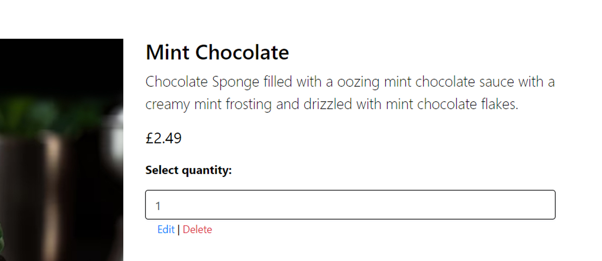
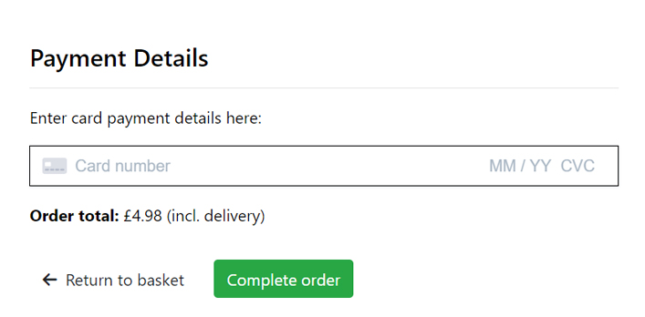
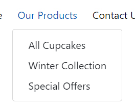
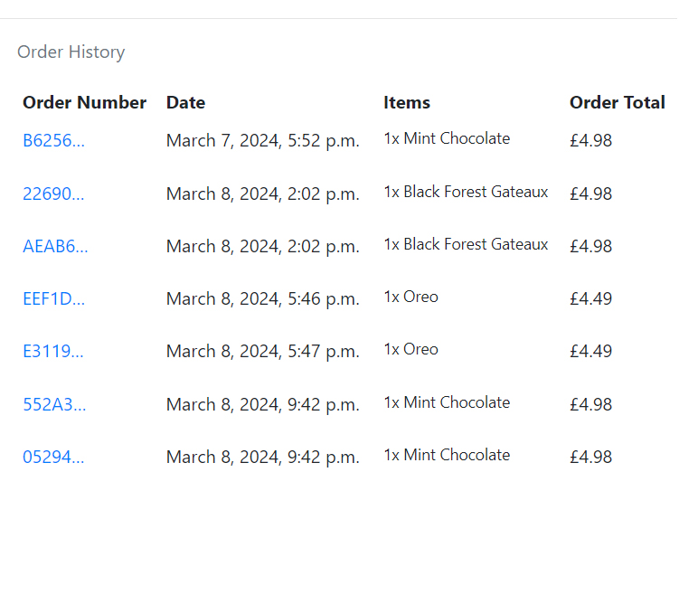
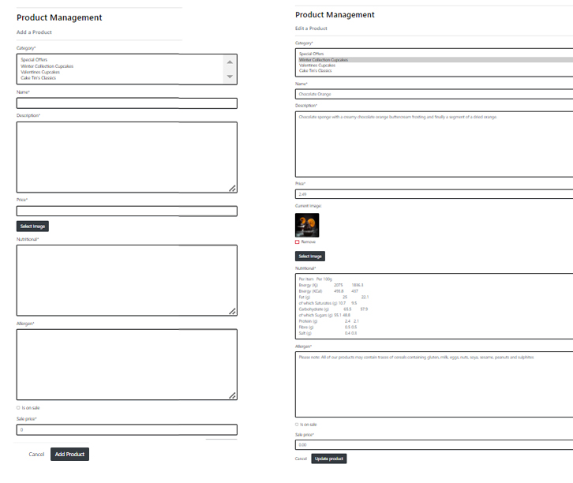
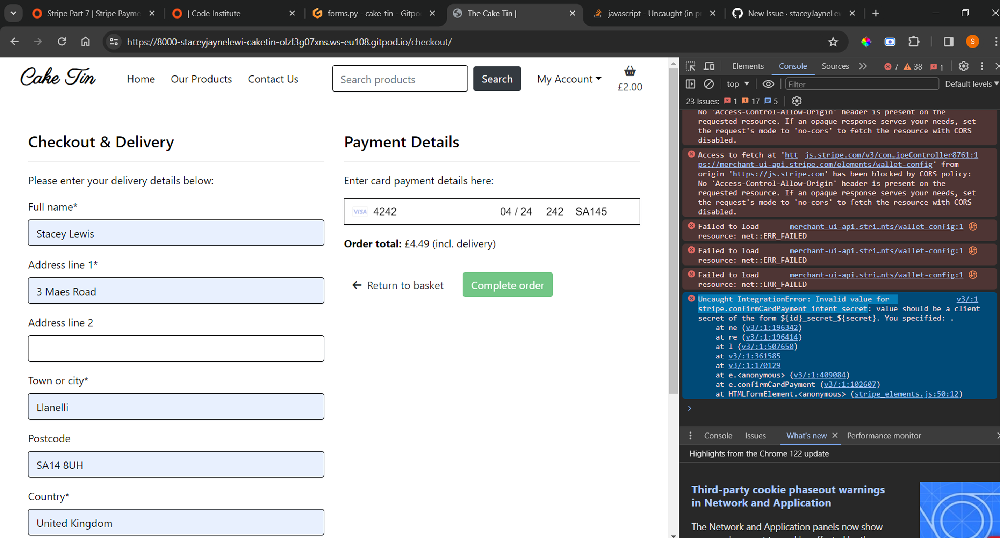

# Testing

Return back to the [README.md](README.md) file.

## Code Validation

### HTML

I have used the recommended [HTML W3C Validator](https://validator.w3.org) to validate all of my HTML files.

| Page | W3C URL | Screenshot | Notes |
| --- | --- | --- | --- |
| Home | [W3C](https://validator.w3.org/nu/?doc=https://cake-tin-c51245f8ed0d.herokuapp.com/) |  | Pass: No Errors |
| Contact | [W3C](https://validator.w3.org/nu/?doc=https://cake-tin-c51245f8ed0d.herokuapp.com/contact/) |  | Pass: No errors |
| Products | [W3C](https://validator.w3.org/nu/?doc=https://cake-tin-c51245f8ed0d.herokuapp.com/products/) |  | Pass: No Errors |
| Product category page | [W3C](https://validator.w3.org/nu/?doc=https://cake-tin-c51245f8ed0d.herokuapp.com/products/?category=classics  ) |  | Pass: No Errors |
| Product number 1 | [W3C](https://validator.w3.org/nu/?doc=https://cake-tin-c51245f8ed0d.herokuapp.com/products/1/) |  | Pass: No Errors |
| Checkout | [W3C](https://validator.w3.org/nu/?doc=https://cake-tin-c51245f8ed0d.herokuapp.com/checkout/) |  | Pass: No Errors |
| Login page |[W3C](https://validator.w3.org/nu/?doc=https://cake-tin-c51245f8ed0d.herokuapp.com/accounts/login/) |  | Pass: No Errors |
| Sign up page |[W3C](https://validator.w3.org/nu/?doc=https://cake-tin-c51245f8ed0d.herokuapp.com/accounts/signup/) |  | Pass: No Errors |
| Password reset page |[W3C](https://validator.w3.org/nu/?doc=https://cake-tin-c51245f8ed0d.herokuapp.com/accounts/password/reset/) |  | Pass: No Errors |
| Basket |[W3C](https://validator.w3.org/nu/?doc=https://cake-tin-c51245f8ed0d.herokuapp.com/basket/) |  | Pass: No Errors |
| Newsletter |[W3C](https://validator.w3.org/nu/?doc=https://cake-tin-c51245f8ed0d.herokuapp.com/newsletter/) |  | Pass: No Errors |
| Profile | W3C |  | No Errors |
| Add Product | W3C |  | Error: duplicate attribute id |
| Edit Product | W3C |  | Error: duplicate attribute id |
| Checkout success page | W3C |  | No Errors |
| Error 404 | W3C |  | No Errors |
| Error 500 | W3C |  | No Errors |

### CSS

I have used the recommended [CSS Jigsaw Validator](https://jigsaw.w3.org/css-validator) to validate all of my CSS files.

| File | Jigsaw URL | Screenshot | Notes |
| --- | --- | --- | --- |
| profile.css | [Jigsaw](https://jigsaw.w3.org/css-validator/validator?uri=https%3A%2F%2FstaceyJayneLewis.github.io%2Fcake-tin) |  | Pass: No Errors |
| base.css | [Jigsaw] |  | Pass: No Errors |

### JavaScript

I have used the recommended [JShint Validator](https://jshint.com) to validate all of my JS files.

| File | Screenshot | Notes |
| --- | --- | --- |
| countryfield.js |  | Pass: No errors |
| stripe_elements.js |  | Pass: No errors |
<!-- JS script within html files -->
| base.html |  | Pass: No errors |
| basket.html |  | Pass: No errors |
| add-product.html |  | Pass: No errors |
| edit-product.html |  | Pass: No errors |

### Python

I have used the recommended [PEP8 CI Python Linter](https://pep8ci.herokuapp.com) to validate all of my Python files.

| File | CI URL | Screenshot | Notes |
| --- | --- | --- | --- |
| manage.py | [PEP8 CI](https://pep8ci.herokuapp.com/https://raw.githubusercontent.com/staceyJayneLewis/cake-tin/main/manage.py) |  | Pass: No Errors |
| custom_storages.py | [PEP8 CI](https://pep8ci.herokuapp.com/https://raw.githubusercontent.com/staceyJayneLewis/cake-tin/main/custom_storages.py) |  | Pass: No Errors |
| profiles/views.py | [PEP8 CI](https://pep8ci.herokuapp.com/https://raw.githubusercontent.com/staceyJayneLewis/cake-tin/main/profiles/views.py) |  | Pass: No Errors |
| profiles/urls.py | [PEP8 CI](https://pep8ci.herokuapp.com/https://raw.githubusercontent.com/staceyJayneLewis/cake-tin/main/profiles/urls.py) |  | Pass: No Errors |
| profiles/models.py | [PEP8 CI](https://pep8ci.herokuapp.com/https://raw.githubusercontent.com/staceyJayneLewis/cake-tin/main/profiles/models.py) |  | Pass: No Errors |
| profiles/forms.py | [PEP8 CI](https://pep8ci.herokuapp.com/https://raw.githubusercontent.com/staceyJayneLewis/cake-tin/main/profiles/forms.py) |  | Pass: No Errors |
| products/widgets.py | [PEP8 CI](https://pep8ci.herokuapp.com/https://raw.githubusercontent.com/staceyJayneLewis/cake-tin/main/products/widgets.py) |  | Pass: No Errors, noqa added as line could not be broken as it was a template url link |
| products/views.py | [PEP8 CI](https://pep8ci.herokuapp.com/https://raw.githubusercontent.com/staceyJayneLewis/cake-tin/main/products/views.py) |  | Pass: No Errors, noqa added as line could not be broken without breaking the link |
| products/urls.py | [PEP8 CI](https://pep8ci.herokuapp.com/https://raw.githubusercontent.com/staceyJayneLewis/cake-tin/main/products/urls.py) |  | Pass: No Errors |
| products/models.py | [PEP8 CI](https://pep8ci.herokuapp.com/https://raw.githubusercontent.com/staceyJayneLewis/cake-tin/main/products/models.py) |  | Pass: No Errors |
| products/forms.py | [PEP8 CI](https://pep8ci.herokuapp.com/https://raw.githubusercontent.com/staceyJayneLewis/cake-tin/main/products/forms.py) |  | Pass: No Errors |
| products/admin.py | [PEP8 CI](https://pep8ci.herokuapp.com/https://raw.githubusercontent.com/staceyJayneLewis/cake-tin/main/products/admin.py) |  | Pass: No Errors |
| products/admin.py | [PEP8 CI](https://pep8ci.herokuapp.com/https://raw.githubusercontent.com/staceyJayneLewis/cake-tin/main/products/admin.py) |  | Pass: No Errors |
| newsletter/views.py | [PEP8 CI](https://pep8ci.herokuapp.com/https://raw.githubusercontent.com/staceyJayneLewis/cake-tin/main/newsletter/views.py) |  | Pass: No Errors |
| newsletter/urls.py | [PEP8 CI](https://pep8ci.herokuapp.com/https://raw.githubusercontent.com/staceyJayneLewis/cake-tin/main/newsletter/urls.py) |  | Pass: No Errors |
| newsletter/models.py | [PEP8 CI](https://pep8ci.herokuapp.com/https://raw.githubusercontent.com/staceyJayneLewis/cake-tin/main/newsletter/models.py) |  | Pass: No Errors |
| newsletter/forms.py | [PEP8 CI](https://pep8ci.herokuapp.com/https://raw.githubusercontent.com/staceyJayneLewis/cake-tin/main/newsletter/forms.py) |  | Pass: No Errors |
| newsletter/admin.py | [PEP8 CI](https://pep8ci.herokuapp.com/https://raw.githubusercontent.com/staceyJayneLewis/cake-tin/main/newsletter/admin.py) |  | Pass: No Errors |
| home/views.py | [PEP8 CI](https://pep8ci.herokuapp.com/https://raw.githubusercontent.com/staceyJayneLewis/cake-tin/main/home/views.py) |  | Pass: No Errors |
| home/urls.py | [PEP8 CI](https://pep8ci.herokuapp.com/https://raw.githubusercontent.com/staceyJayneLewis/cake-tin/main/home/urls.py) |  | Pass: No Errors |
| contact/views.py | [PEP8 CI](https://pep8ci.herokuapp.com/https://raw.githubusercontent.com/staceyJayneLewis/cake-tin/main/contact/views.py) |  | Pass: No Errors |
| contact/urls.py | [PEP8 CI](https://pep8ci.herokuapp.com/https://raw.githubusercontent.com/staceyJayneLewis/cake-tin/main/contact/urls.py) |  | Pass: No Errors |
| contact/models.py | [PEP8 CI](https://pep8ci.herokuapp.com/https://raw.githubusercontent.com/staceyJayneLewis/cake-tin/main/contact/models.py) |  | Pass: No Errors |
| contact/forms.py | [PEP8 CI](https://pep8ci.herokuapp.com/https://raw.githubusercontent.com/staceyJayneLewis/cake-tin/main/contact/forms.py) |  | Pass: No Errors |
| contact/admin.py | [PEP8 CI](https://pep8ci.herokuapp.com/https://raw.githubusercontent.com/staceyJayneLewis/cake-tin/main/contact/admin.py) |  | Pass: No Errors |
| checkout/webhooks.py | [PEP8 CI](https://pep8ci.herokuapp.com/https://raw.githubusercontent.com/staceyJayneLewis/cake-tin/main/checkout/webhooks.py) |  | Pass: No Errors noqa added as line too long and template url could not be split |
| checkout/webhook-handler.py | [PEP8 CI](https://pep8ci.herokuapp.com/https://raw.githubusercontent.com/staceyJayneLewis/cake-tin/main/checkout/webhook_handler.py) |  | Pass: No Errors noqa added as line too long and f strings should not be split |
| checkout/views.py | [PEP8 CI](https://pep8ci.herokuapp.com/https://raw.githubusercontent.com/staceyJayneLewis/cake-tin/main/checkout/views.py) |  | Pass: No Errors noqa added as line could not be split |
| checkout/urls.py | [PEP8 CI](https://pep8ci.herokuapp.com/https://raw.githubusercontent.com/staceyJayneLewis/cake-tin/main/checkout/urls.py) |  | Pass: No Errors |
| checkout/signals.py | [PEP8 CI](https://pep8ci.herokuapp.com/https://raw.githubusercontent.com/staceyJayneLewis/cake-tin/main/checkout/signals.py) |  | Pass: No Errors |
| checkout/models.py | [PEP8 CI](https://pep8ci.herokuapp.com/https://raw.githubusercontent.com/staceyJayneLewis/cake-tin/main/checkout/models.py) |  | Pass: No Errors |
| checkout/models.py | [PEP8 CI](https://pep8ci.herokuapp.com/https://raw.githubusercontent.com/staceyJayneLewis/cake-tin/main/checkout/models.py) |  | Pass: No Errors |
| checkout/forms.py | [PEP8 CI](https://pep8ci.herokuapp.com/https://raw.githubusercontent.com/staceyJayneLewis/cake-tin/main/checkout/forms.py) |  | Pass: No Errors |
| checkout/app.py | [PEP8 CI](https://pep8ci.herokuapp.com/https://raw.githubusercontent.com/staceyJayneLewis/cake-tin/main/checkout/apps.py) |  | Pass: No Errors |
| checkout/admin.py | [PEP8 CI](https://pep8ci.herokuapp.com/https://raw.githubusercontent.com/staceyJayneLewis/cake-tin/main/checkout/admin.py) |  | Pass: No Errors |
| cake_tin/urls.py | [PEP8 CI](https://pep8ci.herokuapp.com/https://raw.githubusercontent.com/staceyJayneLewis/cake-tin/main/cake_tin/urls.py) |  | Pass: No Errors |
| cake_tin/settings.py | [PEP8 CI](https://pep8ci.herokuapp.com/https://raw.githubusercontent.com/staceyJayneLewis/cake-tin/main/cake_tin/settings.py) |  | Pass: No Errors noqa added for auth password validators |
| basket/views.py | [PEP8 CI](https://pep8ci.herokuapp.com/https://raw.githubusercontent.com/staceyJayneLewis/cake-tin/main/basket/views.py) |  | Pass: No Errors |
| basket/urls.py | [PEP8 CI](https://pep8ci.herokuapp.com/https://raw.githubusercontent.com/staceyJayneLewis/cake-tin/main/basket/urls.py) |  | Pass: No Errors |
| basket/contexts.py | [PEP8 CI](https://pep8ci.herokuapp.com/https://raw.githubusercontent.com/staceyJayneLewis/cake-tin/main/basket/contexts.py) |  | Pass: No Errors |
| basket/templatetags/basket-tools.py | [PEP8 CI](https://pep8ci.herokuapp.com/https://raw.githubusercontent.com/staceyJayneLewis/cake-tin/main/basket/templatetags/basket_tools.py) |  | Pass: No Errors |

## Browser Compatibility

I've tested my deployed project on multiple browsers to check for compatibility issues.

| Browser | Home | Product page | Contact | Profile | Manage account | Basket | Notes |
| --- | --- | --- | --- | --- | --- |
| Chrome |  |  |  |  |  |  | Works as expected |
| Brave |  |  |  |  |  |  | Works as expected |
| Firefox |  |  |  |  |  |  | Works as expected |

## Responsiveness

🛑🛑🛑🛑🛑 START OF NOTES (to be deleted) 🛑🛑🛑🛑🛑

Use this space to discuss testing the live/deployed site on various device sizes.

The minimum requirement is for the following 3 tests:
- Mobile
- Tablet
- Desktop

**IMPORTANT**: You must provide screenshots of the tested responsiveness, to "prove" that you've actually tested them.

Using the "amiresponsive" mockup image (or similar) does not suffice the requirements.
Consider using some of the built-in device sizes in the Developer Tools.

If you have tested the project on your actual mobile phone or tablet, consider also including screenshots of these as well.
It showcases a higher level of manual tests, and can be seen as a positive inclusion!

Sample responsiveness testing documentation:

🛑🛑🛑🛑🛑 END OF NOTES (to be deleted) 🛑🛑🛑🛑🛑

I've tested my deployed project on multiple devices to check for responsiveness issues.

| Device | Home | About | Contact | etc | Notes |
| --- | --- | --- | --- | --- | --- |
| Mobile (DevTools) |  |  |  |  | Works as expected |
| Tablet (DevTools) |  |  |  |  | Works as expected |
| Desktop |  |  |  |  | Works as expected |
| XL Monitor |  |  |  |  | Scaling starts to have minor issues |
| 4K Monitor |  |  |  |  | Noticeable scaling issues |
| Google Pixel 7 Pro |  |  |  |  | Works as expected |
| iPhone 14 |  |  |  |  | Works as expected |
| repeat for any other tested browsers | x | x | x | x | x |

## Lighthouse Audit

🛑🛑🛑🛑🛑 START OF NOTES (to be deleted) 🛑🛑🛑🛑🛑

Use this space to discuss testing the live/deployed site's Lighthouse Audit reports.
Avoid testing the local version (especially if developing in Gitpod), as this can have knock-on effects of performance.

If you don't have Lighthouse in your Developer Tools,
it can be added as an [extension](https://chrome.google.com/webstore/detail/lighthouse/blipmdconlkpinefehnmjammfjpmpbjk).

Don't just test the home page (unless it's a single-page application).
Make sure to test the Lighthouse Audit results for all of your pages.

**IMPORTANT**: You must provide screenshots of the results, to "prove" that you've actually tested them.

Sample Lighthouse testing documentation:

🛑🛑🛑🛑🛑 END OF NOTES (to be deleted) 🛑🛑🛑🛑🛑

I've tested my deployed project using the Lighthouse Audit tool to check for any major issues.

| Page | Mobile | Desktop | Notes |
| --- | --- | --- | --- |
| Home |  |  | Some minor warnings |
| About |  |  | Some minor warnings |
| Gallery |  |  | Slow response time due to large images |
| x | x | x | repeat for any other tested pages/sizes |

## Defensive Programming

🛑🛑🛑🛑🛑 START OF NOTES (to be deleted) 🛑🛑🛑🛑🛑

Defensive programming (defensive design) is extremely important!

When building projects that accept user inputs or forms, you should always test the level of security for each.
Examples of this could include (not limited to):

Forms:
- Users cannot submit an empty form
- Users must enter valid email addresses

PP3 (Python-only):
- Users must enter a valid letter/word/string when prompted
- Users must choose from a specific list only

MS3 (Flask) | MS4/PP4/PP5 (Django):
- Users cannot brute-force a URL to navigate to a restricted page
- Users cannot perform CRUD functionality while logged-out
- User-A should not be able to manipulate data belonging to User-B, or vice versa
- Non-Authenticated users should not be able to access pages that require authentication
- Standard users should not be able to access pages intended for superusers

You'll want to test all functionality on your application, whether it's a standard form,
or uses CRUD functionality for data manipulation on a database.
Make sure to include the `required` attribute on any form-fields that should be mandatory.
Try to access various pages on your site as different user types (User-A, User-B, guest user, admin, superuser).

You should include any manual tests performed, and the expected results/outcome.

Testing should be replicable.
Ideally, tests cases should focus on each individual section of every page on the website.
Each test case should be specific, objective, and step-wise replicable.

Instead of adding a general overview saying that everything works fine,
consider documenting tests on each element of the page
(ie. button clicks, input box validation, navigation links, etc.) by testing them in their happy flow,
and also the bad/exception flow, mentioning the expected and observed results,
and drawing a parallel between them where applicable.

Consider using the following format for manual test cases:

Expected Outcome / Test Performed / Result Received / Fixes Implemented

- **Expected**: "Feature is expected to do X when the user does Y."
- **Testing**: "Tested the feature by doing Y."
- (either) **Result**: "The feature behaved as expected, and it did Y."
- (or) **Result**: "The feature did not respond to A, B, or C."
- **Fix**: "I did Z to the code because something was missing."

Use the table below as a basic start, and expand on it using the logic above.

🛑🛑🛑🛑🛑 END OF NOTES (to be deleted) 🛑🛑🛑🛑🛑

Defensive programming was manually tested with the below user acceptance testing:

| Page | Expectation | Test | Result | Fix | Screenshot |
| --- | --- | --- | --- | --- | --- |
| Home | | | | | |
| | Feature is expected to do X when the user does Y | Tested the feature by doing Y | The feature behaved as expected, and it did Y | Test concluded and passed |  |
| | Feature is expected to do X when the user does Y | Tested the feature by doing Y | The feature did not respond to A, B, or C. | I did Z to the code because something was missing |  |
| About | | | | | |
| | Feature is expected to do X when the user does Y | Tested the feature by doing Y | The feature behaved as expected, and it did Y | Test concluded and passed |  |
| | Feature is expected to do X when the user does Y | Tested the feature by doing Y | The feature did not respond to A, B, or C. | I did Z to the code because something was missing |  |
| Gallery | | | | | |
| | Feature is expected to do X when the user does Y | Tested the feature by doing Y | The feature behaved as expected, and it did Y | Test concluded and passed |  |
| | Feature is expected to do X when the user does Y | Tested the feature by doing Y | The feature did not respond to A, B, or C. | I did Z to the code because something was missing |  |
| Contact | | | | | |
| | Feature is expected to do X when the user does Y | Tested the feature by doing Y | The feature behaved as expected, and it did Y | Test concluded and passed |  |
| | Feature is expected to do X when the user does Y | Tested the feature by doing Y | The feature did not respond to A, B, or C. | I did Z to the code because something was missing |  |
| repeat for all remaining pages | x | x | x | x | x |

🛑🛑🛑🛑🛑 START OF NOTES (to be deleted) 🛑🛑🛑🛑🛑

Another way of performing defensive testing is a simple Pass/Fail for each test.
The assessors prefer the above method, with the full test explained, but this is also acceptable in most cases.

When in doubt, use the above method instead, and delete the table below.

🛑🛑🛑🛑🛑 END OF NOTES (to be deleted) 🛑🛑🛑🛑🛑

| Page | User Action | Expected Result | Pass/Fail | Comments |
| --- | --- | --- | --- | --- |
| Home | | | | |
| | Click on Logo | Redirection to Home page | Pass | |
| | Click on Home link in navbar | Redirection to Home page | Pass | |
| Gallery | | | | |
| | Click on Gallery link in navbar | Redirection to Gallery page | Pass | |
| | Load gallery images | All images load as expected | Pass | |
| Contact | | | | |
| | Click on Contact link in navbar | Redirection to Contact page | Pass | |
| | Enter first/last name | Field will accept freeform text | Pass | |
| | Enter valid email address | Field will only accept email address format | Pass | |
| | Enter message in textarea | Field will accept freeform text | Pass | |
| | Click the Submit button | Redirects user to form-dump | Pass | User must click 'Back' button to return |
| Sign Up | | | | |
| | Click on Sign Up button | Redirection to Sign Up page | Pass | |
| | Enter valid email address | Field will only accept email address format | Pass | |
| | Enter valid password (twice) | Field will only accept password format | Pass | |
| | Click on Sign Up button | Asks user to confirm email page | Pass | Email sent to user |
| | Confirm email | Redirects user to blank Sign In page | Pass | |
| Log In | | | | |
| | Click on the Login link | Redirection to Login page | Pass | |
| | Enter valid email address | Field will only accept email address format | Pass | |
| | Enter valid password | Field will only accept password format | Pass | |
| | Click Login button | Redirects user to home page | Pass | |
| Log Out | | | | |
| | Click Logout button | Redirects user to logout page | Pass | Confirms logout first |
| | Click Confirm Logout button | Redirects user to home page | Pass | |
| Profile | | | | |
| | Click on Profile button | User will be redirected to the Profile page | Pass | |
| | Click on the Edit button | User will be redirected to the edit profile page | Pass | |
| | Click on the My Orders link | User will be redirected to the My Orders page | Pass | |
| | Brute forcing the URL to get to another user's profile | User should be given an error | Pass | Redirects user back to own profile |
| repeat for all remaining pages | x | x | x | x |

🛑🛑🛑🛑🛑 START OF NOTES (to be deleted) 🛑🛑🛑🛑🛑

Repeat for all other tests, as applicable to your own site.
The aforementioned tests are just an example of a few different project scenarios.

🛑🛑🛑🛑🛑 END OF NOTES (to be deleted) 🛑🛑🛑🛑🛑

## User Story Testing

### New Site Users

| As a new site user, I would like to register for an account, so that I can have my own account. |  |
| As a new site user, I would like to create a secure password, so that I can be assured my account is secure. |  |
| As a new site user, I would like to view the selection of cakes, so that I can see what the product looks like. |  |
| As a new site user, I would like to see a product description page, so that I can see the price, product description, image and nutrition & allergy details. |  |
| As a new site user, I would like to easily see offer or sale products, so that I can get a good deal which may persuade me to be a returning customer. |  |
| As a new site user, I would like to easily search for a particular cake, so that I do not have to scroll through each product to get to what I am looking for. |  |
| As a new site user, I would like to easily be able to select a quantity of cakes, so that I know how much exactly I am purchasing. |  |
| As a new site user, I would like to easily be able to view items in my bag that I can check what I am purchasing again before payment. |  |
| As a new site user, I would like to receive and view and order confirmation message so that I can verify my order is complete. |  |
| As a new or existing site user I would like to be able to enter payment details so I can simply purchase the good I would like. |  |

### Returning Site Users

| As a returning site user, I would like to simply log in and log out, so that I can easily access my profile page. |  |
| As a returning site user, I would like to have my own profile, so that I can save payment information and view order history.|  |
| As a returning site user, I would like to recover my password if I have forgotten it, so that I can gain access back to my account. |  |
| As a returning site user, have visual sight of my shopping basket , so that I can keep track of the total amount I am spending to make sure it is affordable for me.|  |
| As a returning site user, I would like to see a list of categories of cake types, so that I can easily navigate to the product I want such a new collection or offers and sales.|  |
| As a returning site user, I would like to view recent purchases, so that I don't have to go searching for a product I purchased previously or have to retype the product each time.|  |

### Site Admin

| As a site administrator, I should be able to add new products, so that I can add new items to my store.|  |
| As a site administrator, I should be able to edit products, so that I can edit any items that need amending such a price etc.|  |
| As a site administrator, I should be able to delete products, so that I can remove any products no longer on sale.|  |
| As a site administrator, I should be able to section products into categories, so that I can organise the products easily.|  |
| As a site administrator, I should be able to easily put items on sale, so that I can put special offers on if I want to.|  |

## Bugs

- Form input not filtering products. When I am inputting a word to search it is not refining the products it is just bringing up all the products instead. For example in this screenshot I have searched 'Mint' which should bring up 1 result however it has brought all products up.

    

    - To fix this, I checked the form on the base.html and I noticed I didn't include a name attribute for the input of the form and knowing that python uses name attribute to search queries I needed to include the name='q' for this to work.

- Template syntax error at /

    

    - To fix this, after reviewing the queries and categories video section where it shows you how to refine categories I noticed that I refined the category inside the template tags for the url but it should infact be outside of the tag brackets.
    Once I updated this I can see it worked on the url bar however no products are displaying at the moment, however I will raise this as a new issue.

- When clicking on product categories no products are displaying.

    

    - To fix this, After researching for a solution to this on google and also referring back to the queries and categories part 2 video I noticed that I was missing the split(',') method to split the categories in the url and so when I applied this it instantly worked.

- No reverse match at add_basket

    

    - To fix this, After checking the bug error and researching it on google (I included the source in the credits) I discovered that I was missing the product.id and so the template was only sending one parameter through to the view.

- Error: You are trying to add a non-nullable field 'allergen' to product without a default; we can't do that

    

    - To fix this, after doing some research on the above pages it advised that I needed to add a default parameter for the fields and so once added the 'null'=true it worked as it should.(Again, source included in credits)

- int() argument must be a string, a bytes-like object or a number, not 'NoneType'

    

    - To fix this,I realised that I was missing an int() around the quantity variable value as it needs to be converted to interger since the select options data type are strings.

- Footer not displaying as block element on mobile view.

    

    - To fix this, As you can see above for the mobile view the footer is overlapping the content of the carousel and has no background however on the larger screens its works as expected.
    After checking over my code I noticed that I had a height calculation 'height: calc(100vh - 65px) ' on the home page feature and once commented out the problem was solved, so I removed that bit of code as it is no longer needed.

- (admin.E103) The value of 'inlines' must be a list or tuple.

    

    - To fix this, After having the same message for the read only fields also, I did some research and realised that as it is a tuple I need to include a comma even though there only 1 element in it.

- Reverse for 'products' not found. 'products' is not a valid view function or pattern name.

    

    - To fix this, I discovered the issue was in the products view, I used the functions name rather than the view name on that reverse request which is why it was causing the error.

- Image has spacing above the price of the winter collection category images

    

    - To fix this, I noticed that some of the images with the white backgrounds are different sizes to the cakes images with black backgrounds. After adjusting the image sizes of the white background images to match the sizes of images with black backgrounds it solved the issue of the spacing as the card height's were now able to all be the same.

- Overflow of the products overlay the footer if more than 2 products added to the basket.

    

    - To fix this, After looking over my code it seems some styling I added on the basket page previously is what is causing the issue. I have displayed this in the working tree changes so you can see what I removed for it to work again.

- Subtotal not displaying the amount when added to basket, it just displays basket order total.

    

    - To fix this, an if statement in the success toaster code for when the total amount of items is above 0.

- AuthenticationError at /checkout/

    

    - To fix this, After adding my variables to the env.py file instead of using the gitpod environ variables the issue was resolved. It seemed that the env,py may have been causing confusing with the communication when importing the variable keys.

- Internal error when trying to view my deployed website on heroku

    
    

    - To fix this, After discovering this is the reason I realises i did not add stripe to the requirements.txt file, after I added the stripe to that file and pushed to heroku it now successfullly works.

- Uncaught IntegrationError: Invalid value for stripe.confirmCardPayment intent secret

    
    

    - To fix this, After checking over my code again in the context I noticed I put quotation marks on the value of the intent key and the public key, once removed the issue was fixed. I have put a screenshot of the change below.

- Uncaught IntegrationError: Please call Stripe() with your publishable key. You used an empty string.

    
    

    - To fix this, After tracing back over the code and help from tutor support I seemed to have a post load js code in the checkout success document as well as the checkout page which was not needed as you can see below in the migration changes tree.

- Value too long for type character varying(2) for CountryField

    

    - The solution was to make sure there were not existing orders in the admin of the site as this was causing confusion with the new country field as the country names were more than 2 characters. Once I migrated back to previous migration and deleted the existing order on the admin and added the country field again it was all fixed.

- Footer is within the container in the profile page

    

    - After looking over my profile code and formatting the code I realised I had not closed a div tag which was causing the problem, as soon as I closed the div tags it fixed the issue.

- ValueError at /products/23/ - The 'image' attribute has no file

    

    - After help from my mentor Tim we established that the issue was the python file I was using and I needed to add the runtime file to the project which solved the problem of these errors appearing.

## Unfixed Bugs

🛑🛑🛑🛑🛑 START OF NOTES (to be deleted) 🛑🛑🛑🛑🛑

You will need to mention unfixed bugs and why they were not fixed.
This section should include shortcomings of the frameworks or technologies used.
Although time can be a big variable to consider, paucity of time and difficulty understanding
implementation is not a valid reason to leave bugs unfixed.

If you've identified any unfixed bugs, no matter how small, be sure to list them here.
It's better to be honest and list them, because if it's not documented and an assessor finds the issue,
they need to know whether or not you're aware of them as well, and why you've not corrected/fixed them.

Some examples:

🛑🛑🛑🛑🛑 END OF NOTES (to be deleted) 🛑🛑🛑🛑🛑

- On devices smaller than 375px, the page starts to have `overflow-x` scrolling.

    

    - Attempted fix: I tried to add additional media queries to handle this, but things started becoming too small to read.

- For PP3, when using a helper `clear()` function, any text above the height of the terminal does not clear, and remains when you scroll up.

    

    - Attempted fix: I tried to adjust the terminal size, but it only resizes the actual terminal, not the allowable area for text.

- When validating HTML with a semantic `section` element, the validator warns about lacking a header `h2-h6`. This is acceptable.

    

    - Attempted fix: this is a known warning and acceptable, and my section doesn't require a header since it's dynamically added via JS.

🛑🛑🛑🛑🛑 START OF NOTES (to be deleted) 🛑🛑🛑🛑🛑

If you legitimately cannot find any unfixed bugs or warnings, then use the following sentence:

🛑🛑🛑🛑🛑 END OF NOTES (to be deleted) 🛑🛑🛑🛑🛑

There are no remaining bugs that I am aware of.
