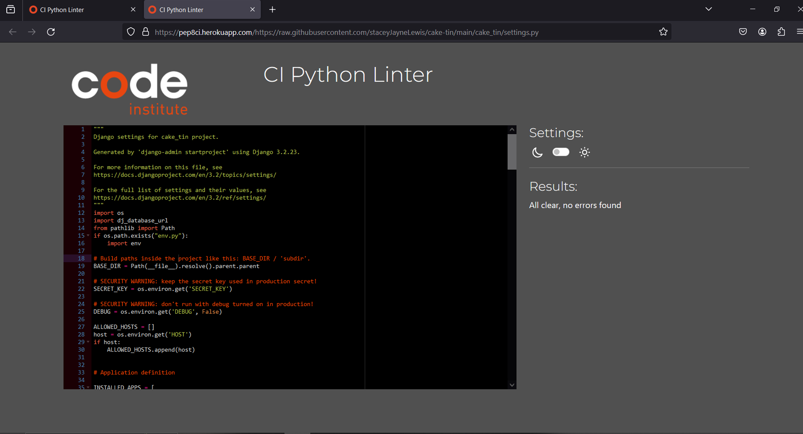
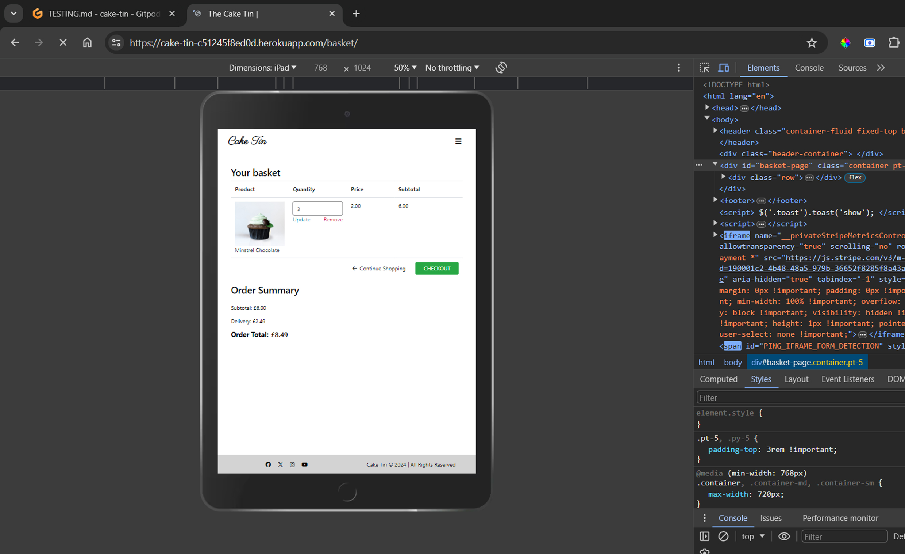
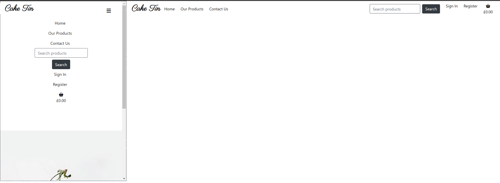
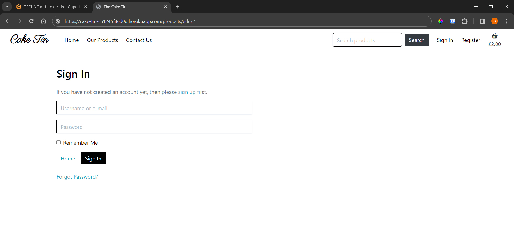
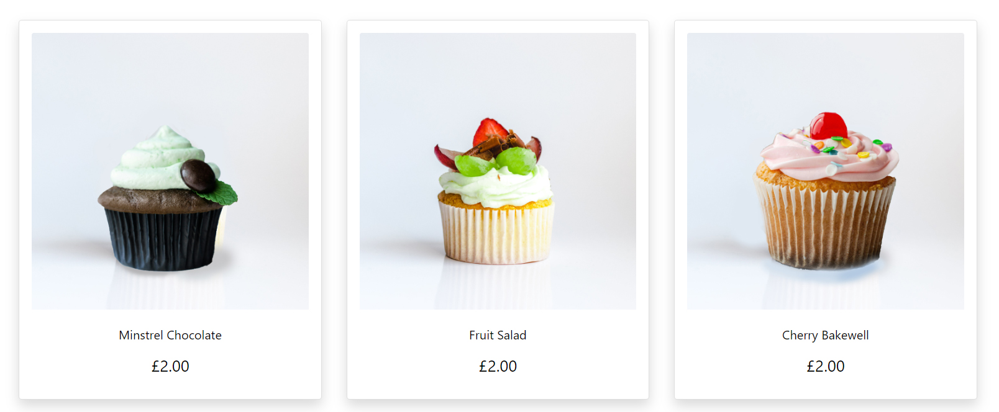
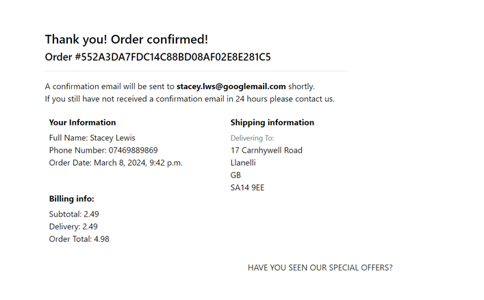
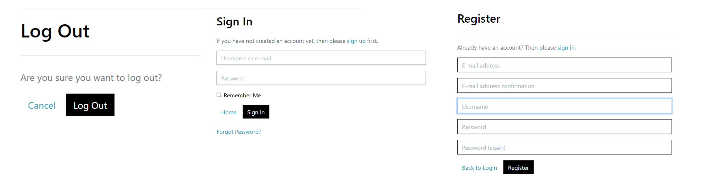
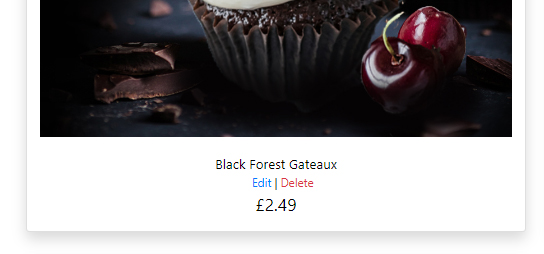
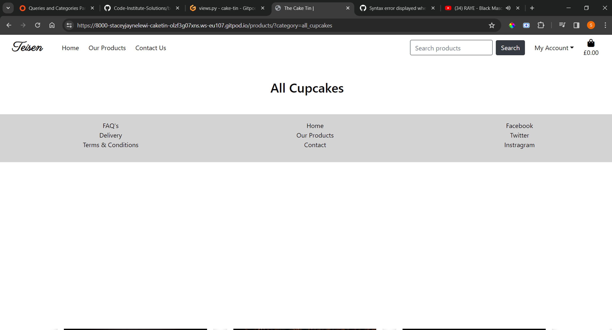

# Testing

Return back to the [README.md](README.md) file.

## Code Validation

### HTML

I have used the recommended [HTML W3C Validator](https://validator.w3.org) to validate all of my HTML files.

| Page | W3C URL | Screenshot | Notes |
| --- | --- | --- | --- |
| Home | [W3C](https://validator.w3.org/nu/?doc=https://cake-tin-c51245f8ed0d.herokuapp.com/) |  | Pass: No Errors |
| Contact | [W3C](https://validator.w3.org/nu/?doc=https://cake-tin-c51245f8ed0d.herokuapp.com/contact/) |  | Pass: No errors |
| Products | [W3C](https://validator.w3.org/nu/?doc=https://cake-tin-c51245f8ed0d.herokuapp.com/products/) |  | Pass: No Errors |
| Product category page | [W3C](https://validator.w3.org/nu/?doc=https://cake-tin-c51245f8ed0d.herokuapp.com/products/?category=classics  ) |  | Pass: No Errors |
| Product number 1 | [W3C](https://validator.w3.org/nu/?doc=https://cake-tin-c51245f8ed0d.herokuapp.com/products/1/) |  | Pass: No Errors |
| Checkout | [W3C](https://validator.w3.org/nu/?doc=https://cake-tin-c51245f8ed0d.herokuapp.com/checkout/) |  | Pass: No Errors |
| Login page |[W3C](https://validator.w3.org/nu/?doc=https://cake-tin-c51245f8ed0d.herokuapp.com/accounts/login/) |  | Pass: No Errors |
| Sign up page |[W3C](https://validator.w3.org/nu/?doc=https://cake-tin-c51245f8ed0d.herokuapp.com/accounts/signup/) |  | Pass: No Errors |
| Password reset page |[W3C](https://validator.w3.org/nu/?doc=https://cake-tin-c51245f8ed0d.herokuapp.com/accounts/password/reset/) |  | Pass: No Errors |
| Basket |[W3C](https://validator.w3.org/nu/?doc=https://cake-tin-c51245f8ed0d.herokuapp.com/basket/) |  | Pass: No Errors |
| Newsletter |[W3C](https://validator.w3.org/nu/?doc=https://cake-tin-c51245f8ed0d.herokuapp.com/newsletter/) |  | Pass: No Errors |
| Profile | W3C |  | No Errors |
| Add Product | W3C |  | Error: duplicate attribute id |
| Edit Product | W3C |  | Error: duplicate attribute id |
| Checkout success page | W3C |  | No Errors |
| Error 404 | W3C |  | No Errors |
| Error 500 | W3C |  | No Errors |

### CSS

I have used the recommended [CSS Jigsaw Validator](https://jigsaw.w3.org/css-validator) to validate all of my CSS files.

| File | Jigsaw URL | Screenshot | Notes |
| --- | --- | --- | --- |
| profile.css | [Jigsaw](https://jigsaw.w3.org/css-validator/validator?uri=https%3A%2F%2FstaceyJayneLewis.github.io%2Fcake-tin) |  | Pass: No Errors |
| base.css | [Jigsaw] |  | Pass: No Errors |

### JavaScript

I have used the recommended [JShint Validator](https://jshint.com) to validate all of my JS files.

| File | Screenshot | Notes |
| --- | --- | --- |
| countryfield.js |  | Pass: No errors |
| stripe_elements.js |  | Pass: No errors |
| base.html |  | Pass: No errors |
| basket.html |  | Pass: No errors |
| add-product.html |  | Pass: No errors |
| edit-product.html |  | Pass: No errors |

### Python

I have used the recommended [PEP8 CI Python Linter](https://pep8ci.herokuapp.com) to validate all of my Python files.

| File | CI URL | Screenshot | Notes |
| --- | --- | --- | --- |
| manage.py | [PEP8 CI](https://pep8ci.herokuapp.com/https://raw.githubusercontent.com/staceyJayneLewis/cake-tin/main/manage.py) |  | Pass: No Errors |
| custom_storages.py | [PEP8 CI](https://pep8ci.herokuapp.com/https://raw.githubusercontent.com/staceyJayneLewis/cake-tin/main/custom_storages.py) |  | Pass: No Errors |
| profiles/views.py | [PEP8 CI](https://pep8ci.herokuapp.com/https://raw.githubusercontent.com/staceyJayneLewis/cake-tin/main/profiles/views.py) |  | Pass: No Errors |
| profiles/urls.py | [PEP8 CI](https://pep8ci.herokuapp.com/https://raw.githubusercontent.com/staceyJayneLewis/cake-tin/main/profiles/urls.py) |  | Pass: No Errors |
| profiles/models.py | [PEP8 CI](https://pep8ci.herokuapp.com/https://raw.githubusercontent.com/staceyJayneLewis/cake-tin/main/profiles/models.py) |  | Pass: No Errors |
| profiles/forms.py | [PEP8 CI](https://pep8ci.herokuapp.com/https://raw.githubusercontent.com/staceyJayneLewis/cake-tin/main/profiles/forms.py) |  | Pass: No Errors |
| products/widgets.py | [PEP8 CI](https://pep8ci.herokuapp.com/https://raw.githubusercontent.com/staceyJayneLewis/cake-tin/main/products/widgets.py) |  | Pass: No Errors, noqa added as line could not be broken as it was a template url link |
| products/views.py | [PEP8 CI](https://pep8ci.herokuapp.com/https://raw.githubusercontent.com/staceyJayneLewis/cake-tin/main/products/views.py) |  | Pass: No Errors, noqa added as line could not be broken without breaking the link |
| products/urls.py | [PEP8 CI](https://pep8ci.herokuapp.com/https://raw.githubusercontent.com/staceyJayneLewis/cake-tin/main/products/urls.py) |  | Pass: No Errors |
| products/models.py | [PEP8 CI](https://pep8ci.herokuapp.com/https://raw.githubusercontent.com/staceyJayneLewis/cake-tin/main/products/models.py) |  | Pass: No Errors |
| products/forms.py | [PEP8 CI](https://pep8ci.herokuapp.com/https://raw.githubusercontent.com/staceyJayneLewis/cake-tin/main/products/forms.py) |  | Pass: No Errors |
| products/admin.py | [PEP8 CI](https://pep8ci.herokuapp.com/https://raw.githubusercontent.com/staceyJayneLewis/cake-tin/main/products/admin.py) |  | Pass: No Errors |
| products/admin.py | [PEP8 CI](https://pep8ci.herokuapp.com/https://raw.githubusercontent.com/staceyJayneLewis/cake-tin/main/products/admin.py) |  | Pass: No Errors |
| newsletter/views.py | [PEP8 CI](https://pep8ci.herokuapp.com/https://raw.githubusercontent.com/staceyJayneLewis/cake-tin/main/newsletter/views.py) |  | Pass: No Errors |
| newsletter/urls.py | [PEP8 CI](https://pep8ci.herokuapp.com/https://raw.githubusercontent.com/staceyJayneLewis/cake-tin/main/newsletter/urls.py) |  | Pass: No Errors |
| newsletter/models.py | [PEP8 CI](https://pep8ci.herokuapp.com/https://raw.githubusercontent.com/staceyJayneLewis/cake-tin/main/newsletter/models.py) |  | Pass: No Errors |
| newsletter/forms.py | [PEP8 CI](https://pep8ci.herokuapp.com/https://raw.githubusercontent.com/staceyJayneLewis/cake-tin/main/newsletter/forms.py) |  | Pass: No Errors |
| newsletter/admin.py | [PEP8 CI](https://pep8ci.herokuapp.com/https://raw.githubusercontent.com/staceyJayneLewis/cake-tin/main/newsletter/admin.py) |  | Pass: No Errors |
| home/views.py | [PEP8 CI](https://pep8ci.herokuapp.com/https://raw.githubusercontent.com/staceyJayneLewis/cake-tin/main/home/views.py) |  | Pass: No Errors |
| home/urls.py | [PEP8 CI](https://pep8ci.herokuapp.com/https://raw.githubusercontent.com/staceyJayneLewis/cake-tin/main/home/urls.py) |  | Pass: No Errors |
| contact/views.py | [PEP8 CI](https://pep8ci.herokuapp.com/https://raw.githubusercontent.com/staceyJayneLewis/cake-tin/main/contact/views.py) |  | Pass: No Errors |
| contact/urls.py | [PEP8 CI](https://pep8ci.herokuapp.com/https://raw.githubusercontent.com/staceyJayneLewis/cake-tin/main/contact/urls.py) |  | Pass: No Errors |
| contact/models.py | [PEP8 CI](https://pep8ci.herokuapp.com/https://raw.githubusercontent.com/staceyJayneLewis/cake-tin/main/contact/models.py) |  | Pass: No Errors |
| contact/forms.py | [PEP8 CI](https://pep8ci.herokuapp.com/https://raw.githubusercontent.com/staceyJayneLewis/cake-tin/main/contact/forms.py) |  | Pass: No Errors |
| contact/admin.py | [PEP8 CI](https://pep8ci.herokuapp.com/https://raw.githubusercontent.com/staceyJayneLewis/cake-tin/main/contact/admin.py) |  | Pass: No Errors |
| checkout/webhooks.py | [PEP8 CI](https://pep8ci.herokuapp.com/https://raw.githubusercontent.com/staceyJayneLewis/cake-tin/main/checkout/webhooks.py) |  | Pass: No Errors noqa added as line too long and template url could not be split |
| checkout/webhook-handler.py | [PEP8 CI](https://pep8ci.herokuapp.com/https://raw.githubusercontent.com/staceyJayneLewis/cake-tin/main/checkout/webhook_handler.py) |  | Pass: No Errors noqa added as line too long and f strings should not be split |
| checkout/views.py | [PEP8 CI](https://pep8ci.herokuapp.com/https://raw.githubusercontent.com/staceyJayneLewis/cake-tin/main/checkout/views.py) |  | Pass: No Errors noqa added as line could not be split |
| checkout/urls.py | [PEP8 CI](https://pep8ci.herokuapp.com/https://raw.githubusercontent.com/staceyJayneLewis/cake-tin/main/checkout/urls.py) |  | Pass: No Errors |
| checkout/signals.py | [PEP8 CI](https://pep8ci.herokuapp.com/https://raw.githubusercontent.com/staceyJayneLewis/cake-tin/main/checkout/signals.py) |  | Pass: No Errors |
| checkout/models.py | [PEP8 CI](https://pep8ci.herokuapp.com/https://raw.githubusercontent.com/staceyJayneLewis/cake-tin/main/checkout/models.py) |  | Pass: No Errors |
| checkout/models.py | [PEP8 CI](https://pep8ci.herokuapp.com/https://raw.githubusercontent.com/staceyJayneLewis/cake-tin/main/checkout/models.py) |  | Pass: No Errors |
| checkout/forms.py | [PEP8 CI](https://pep8ci.herokuapp.com/https://raw.githubusercontent.com/staceyJayneLewis/cake-tin/main/checkout/forms.py) |  | Pass: No Errors |
| checkout/app.py | [PEP8 CI](https://pep8ci.herokuapp.com/https://raw.githubusercontent.com/staceyJayneLewis/cake-tin/main/checkout/apps.py) |  | Pass: No Errors |
| checkout/admin.py | [PEP8 CI](https://pep8ci.herokuapp.com/https://raw.githubusercontent.com/staceyJayneLewis/cake-tin/main/checkout/admin.py) |  | Pass: No Errors |
| cake_tin/urls.py | [PEP8 CI](https://pep8ci.herokuapp.com/https://raw.githubusercontent.com/staceyJayneLewis/cake-tin/main/cake_tin/urls.py) |  | Pass: No Errors |
| cake_tin/settings.py | [PEP8 CI](https://pep8ci.herokuapp.com/https://raw.githubusercontent.com/staceyJayneLewis/cake-tin/main/cake_tin/settings.py) |  | Pass: No Errors noqa added for auth password validators |
| basket/views.py | [PEP8 CI](https://pep8ci.herokuapp.com/https://raw.githubusercontent.com/staceyJayneLewis/cake-tin/main/basket/views.py) |  | Pass: No Errors |
| basket/urls.py | [PEP8 CI](https://pep8ci.herokuapp.com/https://raw.githubusercontent.com/staceyJayneLewis/cake-tin/main/basket/urls.py) |  | Pass: No Errors |
| basket/contexts.py | [PEP8 CI](https://pep8ci.herokuapp.com/https://raw.githubusercontent.com/staceyJayneLewis/cake-tin/main/basket/contexts.py) |  | Pass: No Errors |
| basket/templatetags/basket-tools.py | [PEP8 CI](https://pep8ci.herokuapp.com/https://raw.githubusercontent.com/staceyJayneLewis/cake-tin/main/basket/templatetags/basket_tools.py) |  | Pass: No Errors |

## Browser Compatibility

I've tested my deployed project on multiple browsers to check for compatibility issues.

| Browser | Home | Product page | Contact | Profile | Manage account | Basket | Notes |
| --- | --- | --- | --- | --- | --- | --- | --- |
| Chrome |  |  |  |  |  |  | Works as expected |
| Brave |  |  |  |  |  |  | Works as expected |
| Firefox |  |  |  |  |  |  | Works as expected |

## Responsiveness

I've tested my deployed project on multiple devices to check for responsiveness issues. As there are so many pages to test responsivness on I have split the table into two 2 tables.

| Device | Home | Products | Contact | Profile | Manage Account | Notes |
| --- | --- | --- | --- | --- | --- | --- |
| Mobile (DevTools) |  |  |  |  |  | Works as expected |
| Tablet (DevTools) |  |  |  |  |  | Works as expected |
| Desktop |  |  |  |  |  | Works as expected |
| Huawei p20 pro |  |  |  |  |  | Works as expected |
| Google Pixel 7 |  |  |  |  |  | Works as expected |

| Devices | Basket | Prod description | Checkout | Edit | Register | Sign in | Notes |
| --- | --- | --- | --- | --- | --- | --- | --- |
| Mobile (DevTools) |  |  |  |  |  |  | Works as expected |
| Tablet (DevTools) |  |  |  |  |  |  | Works as expected |
| Desktop |  |  |  |  |  |  | Works as expected |
| Huawei p20 pro |  |  |  |  |  |  | Works as expected |
| Google pixel 7 |  |  |  |  |  |  | Works as expected |

## Lighthouse Audit

I've tested my deployed project using the Lighthouse Audit tool to check for any major issues.

| Page | Mobile | Desktop | Notes |
| --- | --- | --- | --- |
| Home |  |  | Some warnings particularly on mobile devices due to large images and third parties used e.g bootstrap, stripe etc |
| Products |  |  | Some warnings particularly on mobile devices due amount of images and third parties used e.g bootstrap, stripe etc |
| Contact |  |  | Some warnings particularly on mobile devices due to third parties used e.g bootstrap, stripe etc |
| Profile |  |  | Some warnings particularly on mobile devices third parties used e.g bootstrap, stripe etc |
| Add Product |  |  | Some warnings particularly on mobile devices due to third parties used e.g bootstrap, stripe etc |
| Basket |  |  | Some warnings particularly on mobile devices due to third parties used e.g bootstrap, stripe etc|
| Product Description |  |  | Some warnings particularly on mobile devices due to third parties used e.g bootstrap, stripe etc |
| Checkout Success |  |  | Some warnings particularly on mobile devices due to third parties used e.g bootstrap, stripe etc |
| Edit Product |  |  | Some warnings particularly on mobile devices due to third parties used e.g bootstrap, stripe etc |
| Register |  |  | Some warnings particularly on mobile devices due to third parties used e.g bootstrap, stripe etc |
| Sign in |  |  | Some warnings particularly on mobile devices due to third parties used e.g bootstrap, stripe etc |
| Payment Page |  |  | Some warnings particularly on mobile devices due to third parties used e.g bootstrap, stripe etc |

## Defensive Programming

Defensive programming was manually tested with the below user acceptance testing:

| Page | Expectation | Test | Result | Fix | Screenshot |
| --- | --- | --- | --- | --- | --- |
| Home | | | | | |
| | Brand logo and home button on navbar is expected take user back to the home page when clicked | Tested the feature by going to a different page and clicking the logo to see if it directs me back to the home page | The feature behaved as expected | Test concluded and passed |  |
| | Shop now button expected to take the user to the Winter Collection page when clicked | Tested the feature by clicking on the button and checking it directs me to the correct page | Feature behaved as expected | Test concluded and passed |  |
| | Carousel indicators on home page carousel should change photos to a different photo when clicked | Tested the feature by clicking on other indicators to see if the image changes on the carousel | Feature behaved as expected | Test concluded and passed |  |
| | Subscribe button should direct me to the newsletter page when clicked | Tested the feature by clicking on the 'Subscribe now' button | Feature behaved as expected |Test concluded and passed |  |
| | 'Our products' button opens a dropdown of category options | Tested the feature by clicking on the 'Our Product' button | Feature behaved and passed |Test concluded and passed |  |
| |All category option buttons on the dropdown of category options direct to their related page e.g Winter collection directs to winter collections page etc | Tested the features by clicking on all of the options of the buttons and checking they directed to the relevant page. | Feature behaved and passed |Test concluded and passed |  |
| |Expect contact button on the navbar to direct me to the contact page when clicked | Tested the feature by clicking on the 'contact' button and checking it directs to the contact page | Feature behaved as expected |Test concluded and passed |  |
| |Search input and search button returns the related product when entered a search name in the input and search buttons clicked | Tested the feature by typing in the word 'Mint' to see if it returns the mint chocolate cake in the search results on the page and in the url | Feature behaved as expected |Test concluded and passed |  |
| | When 'My Account' dropdown button is clicked it reveals a dropdown displaying the options of 'My profile', 'log out' and 'Manage store' if user is logged in  | 'My account' button is clicked to see if it reveals the dropdown as expected | Feature behaved as expected |Test concluded and passed |  |
| | When 'My Profile' button is clicked I should get directed to the profile page of the user if signed in | I clicked the 'My Profile' button which directed me to my profile page as expected. | Feature behaved as expected |Test concluded and passed |  |
| | When a user is not signed in to an account they should not be able to see the 'My Profile' option or be able to use the URL to access the profile page, instead they should be provided the sign in page | I signed out of my user account to see if I could see the my profile option and tried manually typing the profile in the URL(https://cake-tin-c51245f8ed0d.herokuapp.com/profile/) | Feature behaved as expected | Test concluded and passed |  | 
| | Footer social media link should open up the related social media page e.g facebook icon opens facebook page in new tab  | Tested the icons by clicking on each of the 4 icons and seeing if they open up the correct link to their social media page | Feature behaves as expected | Test concluded and passed |  |
| |If nothing is entered in the search input form in the navbar when search button is clicked it will return an error toaster telling users they did not enter a product and direct them to the 'All Cupcakes' page | Tested this by clicking the search button without entering anything in the input box | Feature behaved as expected |Test concluded and passed |  |
| | Basket button on the navbar is expected to go to the basket page and display products in the basket if there is any in the session or display a message which states 'basket it empty' | Tested the feature by clicking on the basket button in the navbar | The feature behaved as expected | Test concluded and passed |  |
| Profile | | | | | |
| | An error 404 should display if a non existing profile is entered into the URL or for any unrecognised page links | I attempted to get to a profile using an unregistered username or link | Error: 404 displayed as expected |Test concluded and passed |  |
| Our Products | | | | | |
| | When signed in to a different account that is not a superuser they should not be able to see the edit/delete buttons on the product images | Tested the feature by creating a new non-superuser account and going to the 'All Cupcakes' page | The feature behaved as expected, and did not show the edit/delete buttons | Test concluded and passed |  |
| | Any superuser should not be able to add/edit or delete products when not signed in | Tested the feature by trying the following links in the url (https://cake-tin-c51245f8ed0d.herokuapp.com/products/add)(https://cake-tin-c51245f8ed0d.herokuapp.com/products/edit/2)(https://cake-tin-c51245f8ed0d.herokuapp.com/products/delete/2)| The feature behaved as expected and displayed the sign in page and did not display any of the CRUD pages. | Test concluded and passed |  |
| Contact Page | | | | | |
| | User should not be able to submit the contact form if the required fields are blank | Tested the feature by clicking on the submit button on the contact form on the contage page without enterring any information | The feature behaved as expected, as it displayed an alert saying 'Please fill in this field' and form did not submit. | Test concluded and passed |  |
| | If all required fields are filled in then the form should submit and display a confirmation message. | Tested the feature by correctly filling in the form and submitting the contact form | The feature behaved as expected, as it displayed an alert saying 'Thank you for your message we will get back to you soon!'. | Test concluded and passed |  |
| Checkout Page | | | | | |
| | Users should not be able to submit payment form if any required fields are blank | Tested this by clicking the 'Complete Order' button leaving the required fields blank | The feature behaved as expected, as it displayed an alert saying 'Please fill in this field' and form did not submit. | Test concluded and passed | |
| |The country field of the checkout option should be a dropdown so the users can easily select from options and all conform to the same format | Tested this by going to the checkout page on both super user and non-super user and non-registered users to see if the dropdown is applied and gives the option of countries to all types of customers | The feature behaved as expected and had the same dropdown and options for all types of users | Test concluded and passed |  |
| | If user is not logged in it should prompt user to sign in or register if they would like to save their details or if they are signed in they should have an option of a checkbox automatically ticked | Tested this by making sure i'm signed out and trying to checkout and also signing in and attempting to checkout | The feature behaved as expected and prompted me to log in or register when not signed in or when signed in added my details to my default details on my profile | Test concluded and passed |  |
| | Users should not be able to submit card payment if card details are invalid | Tested this by putting in a historic expiry date on the payment details on the checkout page | The feature behaved as expected by advising an error which states the specific problem | Test concluded and passed |  |
| Sign in | | | | | |
| | User should not be permitted to submit empty form | Tested the feature by clicking the sign in button to see if submits the form with empty inputs | The feature behaved as expected, 'Sign in' button clicked and prompt came up telling user to fill in event name field | Test concluded and passed |  |
| | User should not be able to log in with incorrect password | Tested the feature by attempting to log in with an incorrect password | The feature behaved as expected, I recieved an error message which states 'username/password' incorrect | Test concluded and passed |  |
| Register | | | | | |
| | User should not be permitted to submit empty form | Tested the feature by clicking the register button to see if submits the form with empty inputs | The feature behaved as expected, 'register' button clicked and prompt came up telling user to fill in event name fields | Test concluded and passed |  |
| | Password must contain atleast 8 characters | Tested the feature by inputting a password shorter than 8 character | The feature behaved as expected, prompt shown that password was too short | Test concluded and passed |  |
| | Password must match confirm password | Tested the feature by typing in a different password in the confirm password compared to the password field | Feature behaved as expected, flash message of 'passwords must match' shows on screen if confirm password and password are different | Test concluded and passed |  |

## User Story Testing

| User Story | Screenshot |
| --- | --- |
| As a new site user, I would like to register for an account, so that I can have my own account. |  |
| As a new site user, I would like to create a secure password, so that I can be assured my account is secure. |  |
| As a new site user, I would like to view the selection of cakes, so that I can see what the product looks like. |  |
| As a new site user, I would like to see a product description page, so that I can see the price, product description, image and nutrition & allergy details. |  |
| As a new site user, I would like to easily see offer or sale products, so that I can get a good deal which may persuade me to be a returning customer. |  |
| As a new site user, I would like to easily search for a particular cake, so that I do not have to scroll through each product to get to what I am looking for. |  |
| As a new site user, I would like to easily be able to select a quantity of cakes, so that I know how much exactly I am purchasing. |  |
| As a new site user, I would like to easily be able to view items in my bag that I can check what I am purchasing again before payment. |  |
| As a new site user, I would like to receive and view and order confirmation message so that I can verify my order is complete. |  |
| As a new or existing site user I would like to be able to enter payment details so I can simply purchase the good I would like. |  |
| As a returning site user, I would like to simply log in and log out, so that I can easily access my profile page. |  |
| As a returning site user, I would like to have my own profile, so that I can save payment information and view order history.|  |
| As a returning site user, I would like to recover my password if I have forgotten it, so that I can gain access back to my account. |  |
| As a returning site user, have visual sight of my shopping basket , so that I can keep track of the total amount I am spending to make sure it is affordable for me.|  |
| As a returning site user, I would like to see a list of categories of cake types, so that I can easily navigate to the product I want such a new collection or offers and sales.|  |
| As a returning site user, I would like to view recent purchases, so that I don't have to go searching for a product I purchased previously or have to retype the product each time.|  |
| As a site administrator, I should be able to add new products, so that I can add new items to my store.|  |
| As a site administrator, I should be able to edit products, so that I can edit any items that need amending such a price etc.|  |
| As a site administrator, I should be able to delete products, so that I can remove any products no longer on sale.|  |
| As a site administrator, I should be able to section products into categories, so that I can organise the products easily.|  |
| As a site administrator, I should be able to easily put items on sale, so that I can put special offers on if I want to.|  |

## Bugs

- Form input not filtering products. When I am inputting a word to search it is not refining the products it is just bringing up all the products instead. For example in this screenshot I have searched 'Mint' which should bring up 1 result however it has brought all products up.

    

    - To fix this, I checked the form on the base.html and I noticed I didn't include a name attribute for the input of the form and knowing that python uses name attribute to search queries I needed to include the name='q' for this to work.

- Template syntax error at /

    

    - To fix this, after reviewing the queries and categories video section where it shows you how to refine categories I noticed that I refined the category inside the template tags for the url but it should infact be outside of the tag brackets.
    Once I updated this I can see it worked on the url bar however no products are displaying at the moment, however I will raise this as a new issue.

- When clicking on product categories no products are displaying.

    

    - To fix this, After researching for a solution to this on google and also referring back to the queries and categories part 2 video I noticed that I was missing the split(',') method to split the categories in the url and so when I applied this it instantly worked.

- No reverse match at add_basket

    

    - To fix this, After checking the bug error and researching it on google (I included the source in the credits) I discovered that I was missing the product.id and so the template was only sending one parameter through to the view.

- Error: You are trying to add a non-nullable field 'allergen' to product without a default; we can't do that

    

    - To fix this, after doing some research on the above pages it advised that I needed to add a default parameter for the fields and so once added the 'null'=true it worked as it should.(Again, source included in credits)

- int() argument must be a string, a bytes-like object or a number, not 'NoneType'

    

    - To fix this,I realised that I was missing an int() around the quantity variable value as it needs to be converted to interger since the select options data type are strings.

- Footer not displaying as block element on mobile view.

    

    - To fix this, As you can see above for the mobile view the footer is overlapping the content of the carousel and has no background however on the larger screens its works as expected.
    After checking over my code I noticed that I had a height calculation 'height: calc(100vh - 65px) ' on the home page feature and once commented out the problem was solved, so I removed that bit of code as it is no longer needed.

- (admin.E103) The value of 'inlines' must be a list or tuple.

    

    - To fix this, After having the same message for the read only fields also, I did some research and realised that as it is a tuple I need to include a comma even though there only 1 element in it.

- Reverse for 'products' not found. 'products' is not a valid view function or pattern name.

    

    - To fix this, I discovered the issue was in the products view, I used the functions name rather than the view name on that reverse request which is why it was causing the error.

- Image has spacing above the price of the winter collection category images

    

    - To fix this, I noticed that some of the images with the white backgrounds are different sizes to the cakes images with black backgrounds. After adjusting the image sizes of the white background images to match the sizes of images with black backgrounds it solved the issue of the spacing as the card height's were now able to all be the same.

- Overflow of the products overlay the footer if more than 2 products added to the basket.

    

    - To fix this, After looking over my code it seems some styling I added on the basket page previously is what is causing the issue. I have displayed this in the working tree changes so you can see what I removed for it to work again.

- Subtotal not displaying the amount when added to basket, it just displays basket order total.

    

    - To fix this, adding an if statement in the success toaster code for when the total amount of items is above 0.

- AuthenticationError at /checkout/

    

    - To fix this, After adding my variables to the env.py file instead of using the gitpod environ variables the issue was resolved. It seemed that the env,py may have been causing confusing with the communication when importing the variable keys.

- Internal error when trying to view my deployed website on heroku

    
    

    - To fix this, After discovering this is the reason I realises i did not add stripe to the requirements.txt file, after I added the stripe to that file and pushed to heroku it now successfullly works.

- Uncaught IntegrationError: Invalid value for stripe.confirmCardPayment intent secret

    
    

    - To fix this, After checking over my code again in the context I noticed I put quotation marks on the value of the intent key and the public key, once removed the issue was fixed. I have put a screenshot of the change below.

- Uncaught IntegrationError: Please call Stripe() with your publishable key. You used an empty string.

    
    

    - To fix this, After tracing back over the code and help from tutor support I seemed to have a post load js code in the checkout success document as well as the checkout page which was not needed as you can see below in the migration changes tree.

- Value too long for type character varying(2) for CountryField

    

    - The solution was to make sure there were not existing orders in the admin of the site as this was causing confusion with the new country field as the country names were more than 2 characters. Once I migrated back to previous migration and deleted the existing order on the admin and added the country field again it was all fixed.

- Footer is within the container in the profile page

    

    - After looking over my profile code and formatting the code I realised I had not closed a div tag which was causing the problem, as soon as I closed the div tags it fixed the issue.

- ValueError at /products/23/ - The 'image' attribute has no file

    

    - After help from my mentor Tim we established that the issue was the python file I was using and I needed to add the runtime file to the project which solved the problem of these errors appearing.

## Unfixed Bugs

- Duplicate attribute id

    
